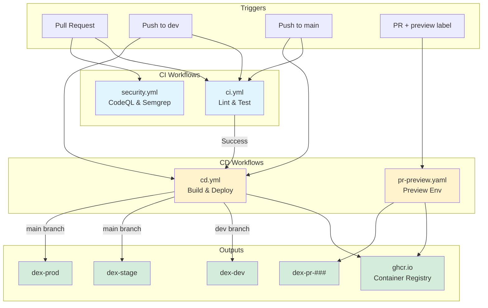
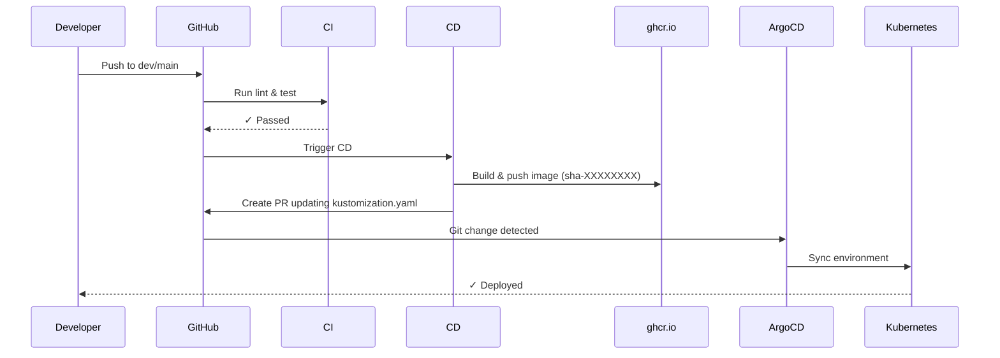

# GitHub Actions Workflows

This folder contains CI/CD automation for DEX.

> **📖 Full Documentation**: See [docs/CI_CD.md](../../docs/CI_CD.md) for comprehensive CI/CD pipeline documentation.

## Workflow Architecture



## Workflows

### `ci.yml` - Continuous Integration
**Triggers**: Push to `main`/`dev`, Pull Requests

**Jobs**:
- **lint-and-test**: Runs ruff, black, mypy, pytest with coverage

**Required for merge**: ✅ All checks must pass

---

### `cd.yml` - Continuous Deployment
**Triggers**: After successful CI on `main` or `dev` branches

**Jobs**:
1. **build-and-push**: Builds Docker image with SHA tag → ghcr.io
2. **update-dev-manifest**: Updates dev kustomization (dev branch only)
3. **update-stage-prod-manifest**: Updates stage/prod kustomization (main branch only)
4. **security-scan**: Runs Trivy vulnerability scanner

**Image Tags**: `sha-XXXXXXXX` (immutable), `latest` (main only)

---

### `pr-preview.yaml` - PR Preview Environments
**Triggers**: PR with `preview` label

**Jobs**:
1. **check-preview-label**: Verifies preview label exists
2. **build-preview**: Builds image and comments on PR

**Usage**:
```bash
gh pr edit <pr-number> --add-label preview
```

**Namespace**: `dex-pr-###` (auto-created by ArgoCD)

---

### `security.yml` - Security Scans
**Triggers**: Push to `main`, Pull Requests to `main`

**Jobs**:
- **CodeQL**: Static analysis for vulnerabilities
- **Semgrep**: OWASP Top 10 checks

**Results**: GitHub Security tab

---

## Image Registry

**Registry**: `ghcr.io/data-literate/dex`

**Image Tags**:
- `sha-XXXXXXXX` - Immutable SHA tag (8 characters)
- `latest` - Latest main branch build
- `pr-###` - PR-specific preview builds

---

## GitOps Flow



### Dev Deployment (Automatic)
```
PR merged to dev → CI passes → CD builds image → CD updates dev/kustomization.yaml → ArgoCD syncs dex-dev
```

### Stage/Prod Deployment (Automatic)
```
PR merged to main → CI passes → CD builds image → CD updates stage+prod/kustomization.yaml → ArgoCD syncs
```

### Manual Promotion (Alternative)
```bash
# Use promotion script
.\scripts\promote.ps1 -FromEnv stage -ToEnv prod -ImageTag sha-abc12345
```

---

## Quick Reference

```bash
# Check CI status
gh pr checks <pr-number>

# View workflow runs
gh run list --workflow ci.yml

# View logs
gh run view <run-id> --log

# Enable preview environment
gh pr edit <pr-number> --add-label preview

# Monitor ArgoCD deployment
argocd app get dex-dev
kubectl get pods -n dex-dev
```

---

## Required Secrets

**Repository Secrets**:
- `GITHUB_TOKEN` - Auto-provided by GitHub Actions

**No additional secrets needed** for basic CI/CD operation.

---

## Troubleshooting

```mermaid
graph TD
    Issue[CI/CD Issue] --> Type{Issue Type?}
    
    Type -->|CI Failure| CheckCI[Check CI logs]
    CheckCI --> LocalTest[\"Run lint locally\"]
    LocalTest --> FixCode[Fix code issues]
    FixCode --> Push[Push changes]
    
    Type -->|CD Not Triggering| CheckWorkflow[\"Check: gh run list\"]
    CheckWorkflow --> VerifyCI[Verify CI passed first]
    VerifyCI --> CheckTrigger[Check workflow_run trigger]
    
    Type -->|Image Not Deploying| CheckKust[Check kustomization.yaml updated]
    CheckKust --> CheckArgo[\"argocd app get dex-env\"]
    CheckArgo --> CheckImage[\"docker pull ghcr.io/.../sha-XXX\"]
    CheckImage --> ForceSync[\"argocd app sync --force\"]
    
    Push --> End[✓ Resolved]
    CheckTrigger --> End
    ForceSync --> End
    
    style Issue fill:#f8d7da
    style End fill:#d4edda
```

### CI Failures
```bash
# Run lint locally
uv run poe lint
uv run poe test
```

### CD Not Triggering
- Verify CI passed successfully
- Check workflow_run trigger in cd.yml
- View workflow runs: `gh run list`

### Image Not Deploying
- Check kustomization.yaml updated: `git log infra/argocd/overlays/dev/kustomization.yaml`
- Verify ArgoCD sync: `argocd app get dex-dev`
- Check image exists: `docker pull ghcr.io/data-literate/dex:sha-XXXXXXXX`

---

## Related Documentation

- **[CI/CD Pipeline Guide](../../docs/CI_CD.md)** - Complete pipeline documentation
- **[SDLC](../../docs/SDLC.md)** - Development lifecycle
- **[Deploy Runbook](../../docs/DEPLOY_RUNBOOK.md)** - Release procedures
- **[Infrastructure](../../infra/README.md)** - GitOps and ArgoCD setup
