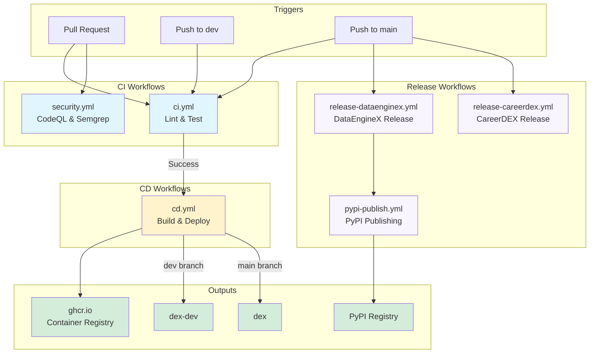
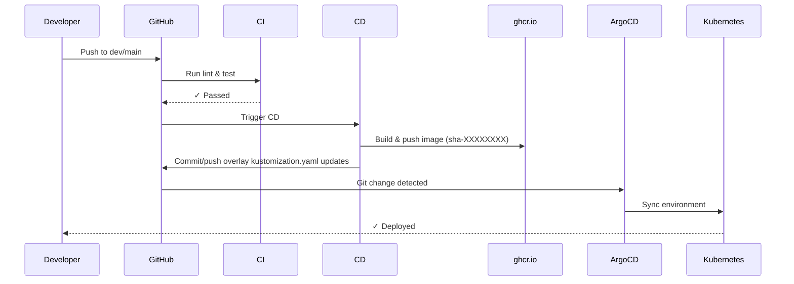

# GitHub Actions Workflows

This folder contains CI/CD automation for DEX.

> **📖 Full Documentation**: See [docs/CI_CD.md](../../docs/CI_CD.md) for comprehensive CI/CD pipeline documentation.

## Workflow Architecture



## Workflows

### `ci.yml` - Continuous Integration
**Triggers**: Push to `main`/`dev`, Pull Requests

**Jobs**:
- **lint-and-test**: Runs Ruff, import checks, mypy, and pytest with coverage

**Required for merge**: ✅ All checks must pass

---

### `cd.yml` - Continuous Deployment
**Triggers**: `workflow_run` after upstream workflow completion on `main`/`dev` (`Continuous Integration`, `Security Scans`, `Package Validation`)

**Branch → Environment Mapping**:
- `dev` → `dex-dev`
- `main` → `dex`

**Jobs**:
1. **gate-dependencies**: Blocks CD unless all required upstream workflows for the same commit SHA are successful
2. **build-and-push**: Builds Docker image with SHA tag → ghcr.io
3. **security-scan**: Runs Trivy vulnerability scanner on produced image
4. **update-gitops-manifests**: Updates the environment overlay matching the branch; direct push with bot token, falls back to PR/issue when branch protection rejects push
5. **verify-deployment**: ArgoCD + optional smoke checks when manifests were updated directly
6. **notify-deployment**: Posts success/failure/pending-manual-approval status notifications

**Image Tags**: `sha-XXXXXXXX` (immutable), `v<project_version>` (main only), `latest` (main only), `dev` (dev only)

---

### `security.yml` - Security Scans
**Triggers**: Push to `main`/`dev`, Pull Requests to `main`/`dev`

**Jobs**:
- **CodeQL**: Static analysis for vulnerabilities
- **Semgrep**: OWASP Top 10 checks

**Results**: GitHub Security tab

---

### `docs-pages.yml` - Documentation Deployment
**Triggers**: Push to `main` on docs/MkDocs changes, manual dispatch

**Jobs**:
- **build**: Builds MkDocs site and uploads Pages artifact
- **deploy**: Publishes site to GitHub Pages

**Custom Domain**: `docs.thedataenginex.org`

---

### `label-sync.yml` - Label Taxonomy Sync
**Triggers**: Push to `main` when `.github/labels.yml` changes, manual dispatch

**Jobs**:
- **sync-labels**: Synchronizes repository labels from `.github/labels.yml`

**Purpose**: Keeps issue/PR labels consistent with maintainer taxonomy.

---

### `project-automation.yml` - Project Intake Automation
**Triggers**: Issue/PR opened/reopened events, manual dispatch

**Jobs**:
- **add-to-org-project**: Adds new issues/PRs to org project board

**Configuration Required**:
- Variable: `ORG_PROJECT_URL`
- Secret: `ORG_PROJECT_TOKEN`

---

## Image Registry

**Registry**: `ghcr.io/thedataenginex/dex`

**Image Tags**:
- `sha-XXXXXXXX` - Immutable SHA tag (8 characters)
- `v<project_version>` - Semantic version tag for main branch builds
- `latest` - Latest main branch build
- `dev` - Moving tag for dev branch builds

---

## GitOps Flow



### Dev Image Build (Automatic)
```
PR merged to dev → CI passes → CD builds and pushes image → security scan runs → dev overlay updated → ArgoCD syncs dex-dev
```

### Prod Deployment
```
PR merged to main (from dev) → CI passes → CD builds and pushes image → security scan runs → prod overlay updated → ArgoCD syncs dex
```

### Manual Promotion (Alternative)
```bash
# Promote dev → prod (creates PR: dev → main)
./scripts/promote.sh

# Promote specific image tag to prod
./scripts/promote.sh --image-tag sha-abc12345
```

---

## Quick Reference

```bash
# Check CI status
gh pr checks <pr-number>

# View workflow runs
gh run list --workflow ci.yml

# View logs
gh run view <run-id> --log

# Monitor ArgoCD deployment
argocd app get dex-dev
kubectl get pods -n dex-dev
```

---

## Required Secrets

**Repository Secrets**:
- `GITHUB_TOKEN` - Auto-provided by GitHub Actions
- `GITOPS_BOT_TOKEN` - Recommended for protected-branch bypass push in CD (fallback PR/issue still works without it)
- `ORG_PROJECT_TOKEN` - Required for project automation auto-add

**Repository Variables**:
- `ORG_PROJECT_URL` - Required for project automation auto-add

---

## Troubleshooting

```mermaid
graph TD
    Issue[CI/CD Issue] --> Type{Issue Type?}

    Type -->|CI Failure| CheckCI[Check CI logs]
    CheckCI --> LocalTest[\"Run lint locally\"]
    LocalTest --> FixCode[Fix code issues]
    FixCode --> Push[Push changes]

    Type -->|CD Not Triggering| CheckWorkflow[\"Check: gh run list\"]
    CheckWorkflow --> VerifyCI[Verify CI passed first]
    VerifyCI --> CheckTrigger[Check workflow_run trigger]

    Type -->|Image Not Deploying| CheckKust[Check kustomization.yaml updated]
    CheckKust --> CheckArgo[\"argocd app get dex-env\"]
    CheckArgo --> CheckImage[\"docker pull ghcr.io/.../sha-XXX\"]
    CheckImage --> ForceSync[\"argocd app sync --force\"]

    Push --> End[✓ Resolved]
    CheckTrigger --> End
    ForceSync --> End

    style Issue fill:#f8d7da
    style End fill:#d4edda
```

### CI Failures
```bash
# Run lint locally
uv run poe lint
uv run poe test
```

### CD Not Triggering
- Verify all required upstream workflows passed on the same commit SHA (`Continuous Integration`, `Security Scans`, `Package Validation`)
- Check workflow_run trigger configuration in `cd.yml`
- View workflow runs: `gh run list`

### Image Not Deploying
- Check kustomization.yaml updated: `git log infra/argocd/overlays/dev/kustomization.yaml`
- Verify ArgoCD sync: `argocd app get dex-dev`
- Check image exists: `docker pull ghcr.io/thedataenginex/dex:sha-XXXXXXXX`

---

## Related Documentation

- **[CI/CD Pipeline Guide](../../docs/CI_CD.md)** - Complete pipeline documentation
- **[SDLC](../../docs/SDLC.md)** - Development lifecycle
- **[Deploy Runbook](../../docs/DEPLOY_RUNBOOK.md)** - Release procedures
- **[Local K8s Setup](../../docs/LOCAL_K8S_SETUP.md)** - GitOps and ArgoCD setup
