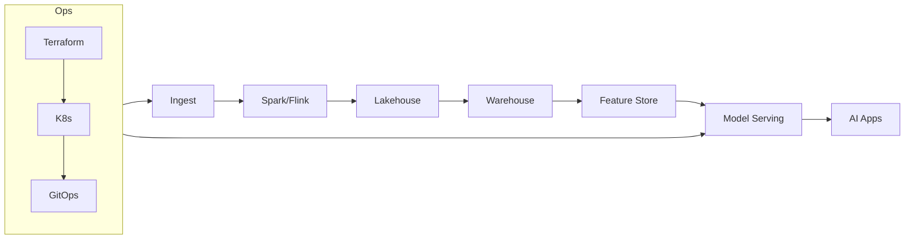

# DataEngineX (DEX)

[](https://github.com/TheDataEngineX/DEX/actions/workflows/ci.yml)
[](https://www.python.org/downloads/)
[](LICENSE)
[](https://github.com/TheDataEngineX/DEX)
[](https://github.com/TheDataEngineX/DEX/releases)

A production-focused data engineering framework with medallion architecture, Airflow orchestration patterns, and enterprise observability foundations. DEX is both a core framework and a mono-repo for sub-projects built on top of it.

---

## Quick Start

```bash
git clone https://github.com/TheDataEngineX/DEX && cd DEX
uv run poe setup            # One-step setup (all deps + pre-commit hooks)
uv run poe dev               # Run dev server → http://localhost:8000
uv run poe test              # Run tests
```

### Full Stack (API + Observability)

```bash
docker compose up -d
```

| Service      | URL                         |
|--------------|-----------------------------|
| API          | http://localhost:8000        |
| Prometheus   | http://localhost:9090        |
| AlertManager | http://localhost:9093        |
| Grafana      | http://localhost:3000        |
| Jaeger       | http://localhost:16686       |

---

## Project Structure

```
DEX/
├── packages/
│   ├── dataenginex/          # Core framework package (canonical source)
│   │   └── packages/dataenginex/src/dataenginex/  #   API utilities, core, middleware
│
├── src/
│   ├── careerdex/             # AI job matching & recommendations app
│   │   ├── core/              #   Notifications (Slack)
│   │   ├── dags/              #   Airflow DAGs
│   │   ├── models/            #   ML models
│   │   └── phases/            #   Implementation phases
│   │
│   └── weatherdex/            # Weather prediction pipeline
│       ├── core/              #   API client & pipeline
│       ├── ml/                #   PySpark ML utilities
│       └── notebooks/         #   Jupyter notebooks
│
├── tests/                     # Test suite
│   ├── unit/                  #   Unit tests
│   └── integration/           #   End-to-end tests
│
├── infra/                     # Infrastructure
│   ├── argocd/                #   Kubernetes manifests (Kustomize + GitOps)
│   │   ├── base/              #     Base deployment, service
│   │   └── overlays/          #     dev, stage, prod overrides
│   └── monitoring/            #   Observability configs
│       ├── prometheus.yml     #     Metrics scraping
│       ├── alertmanager.yml   #     Alert routing
│       ├── alerts/            #     Alert rules
│       └── grafana/           #     Dashboards
│
├── docs/                      # Documentation
├── scripts/                   # Utility scripts
├── learning/                  # Learning experiments
│
├── Dockerfile                 # Multi-stage Docker build
├── docker-compose.yml         # Local dev stack
├── pyproject.toml             # Project config (deps, tools)
├── poe_tasks.toml             # Task runner (poe)
└── CODEOWNERS
```

---

## Architecture

**Medallion Data Pipeline:**

```
Raw Sources (LinkedIn, Indeed, Glassdoor, APIs)
             ↓
        BRONZE LAYER — Raw ingestion (Parquet)
             ↓
        SILVER LAYER — Cleaned & validated (quality ≥ 75%)
             ↓
        GOLD LAYER — Enriched & aggregated (quality ≥ 90%)
             ↓
      API / ML / Analytics
```

**Tech Stack:**

| Layer            | Technology                                      |
|------------------|-------------------------------------------------|
| Language         | Python 3.11+                                    |
| Package Manager  | uv (dependencies/env) + Hatchling (build backend) |
| Web Framework    | FastAPI + Uvicorn                               |
| Orchestration    | Apache Airflow                                  |
| ML               | PySpark                                         |
| Code Quality     | Ruff, mypy (strict)                             |
| Testing          | pytest + coverage                               |
| Observability    | Prometheus, Grafana, Jaeger (OpenTelemetry)     |
| Containers       | Docker + docker compose                         |
| Kubernetes       | Kustomize + ArgoCD (GitOps)                     |
| CI/CD            | GitHub Actions                                  |

---

## Development

See the canonical setup and full command reference in [docs/DEVELOPMENT.md](docs/DEVELOPMENT.md).

```bash
uv run poe check-all         # Lint + typecheck + tests
uv run poe dev               # Dev server with hot-reload
uv run poe docker-up         # Start local stack
```

---

## Documentation

| Guide                                             | Description              |
|---------------------------------------------------|--------------------------|
| [Documentation Hub](docs/docs-hub.md)             | Complete index           |
| [Architecture](docs/ARCHITECTURE.md)              | System design            |
| [Development](docs/DEVELOPMENT.md)                | Local setup              |
| [Contributing](docs/CONTRIBUTING.md)              | Code style, PR process   |
| [Contribution Guide](CONTRIBUTING.md)             | Root contributor entry   |
| [Code of Conduct](CODE_OF_CONDUCT.md)             | Community standards      |
| [Governance & Legal](GOVERNANCE.md)               | Governance model         |
| [CI/CD Pipeline](docs/CI_CD.md)                   | Automation workflows     |
| [Security Policy](SECURITY.md)                    | Vulnerability reporting  |
| [Support Guide](SUPPORT.md)                       | Help & support channels  |
| [Deployment Runbook](docs/DEPLOY_RUNBOOK.md)      | Deploy & rollback        |
| [Observability](docs/OBSERVABILITY.md)            | Metrics, logs, traces    |
| [Local K8s Setup](docs/LOCAL_K8S_SETUP.md)        | Test ArgoCD locally      |
| [SDLC](docs/SDLC.md)                             | Lifecycle stages         |
| [ADRs](docs/adr/)                                 | Architecture decisions   |
| [Roadmap (Canonical CSV)](docs/roadmap/project-roadmap.csv) | Planned and in-progress work |
| [CareerDEX](docs/careerdex/index.md)              | Job matching project     |
| [Weather](docs/weather/index.md)                  | Weather pipeline         |

---

## The DEX Philosophy

DEX bridges **Data Engineering, Warehousing, ML, AI Agents, MLOps, and DevOps** into a unified, AI-ready platform. It is the technical infrastructure that moves AI from a research notebook to production.



---

## Quick Audit Prompt

Audit this repository for deprecated, duplicated, or unnecessary code and documentation.
Apply Up to Date System design, documentation.
Apply DRY principles, remove outdated references, and ensure future‑proof, cloud‑agnostic design.
Recommend only low‑cost, open‑source, maintainable solutions.
Base all feedback strictly on the current repo structure.


Generate a PyPI‑ready Markdown long_description for the next release of DEX.
Follow PyPI best practices, keep it concise.

---

## License and Brand Use

- DEX source code is open and free to use under the [MIT License](LICENSE).
- If you distribute forks, keep attribution and license notices intact.
- The project name/identity is protected by policy: see [Trademark Policy](TRADEMARK_POLICY.md).
- Please do not publish modified forks as if they are the official DataEngineX/DEX project.

---

**Version**: v0.3.6 | **License**: MIT
