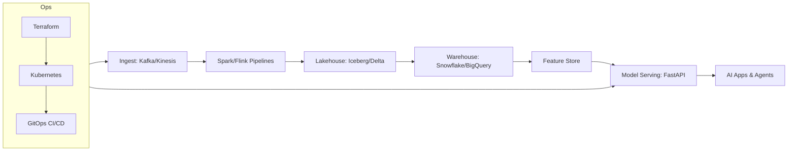

# DEX — DataEngineX

**Production-ready data engineering and ML platform** with FastAPI, automated CI/CD, and GitOps deployment.

## The DEX Philosophy

DEX (DataEngineX) is a unified framework that bridges **Data Engineering, Data Warehousing, Machine Learning, AI Agents, MLOps, and DevOps**. It specializes in building **AI‑ready infrastructure** that is automated, scalable, and resilient — the technical “plumbing” that moves AI from a research notebook to global production.

**Mission:** Deliver an end‑to‑end, cohesive narrative that consolidates data pipelines, lakehouse warehousing, MLOps, AI, and DevOps into one portfolio.



### Portfolio Modules

```
/dex-data       # Spark/Flink/Kafka pipelines + orchestration (Airflow/Dagster)
/dex-warehouse  # dbt models + lakehouse/warehouse patterns
/dex-lakehouse  # Parquet/Avro + Iceberg/Delta demos
/dex-ml         # MLflow/Kubeflow + model training/serving
/dex-api        # FastAPI layer for features + predictions
/dex-ops        # Terraform + Kubernetes + CI/CD GitOps
```

These modules are a **roadmap** for the full DEX portfolio and will be added iteratively.

### Technical Toolbox

- **Data Engineering**: Spark, Kafka, Airflow, Flink, dbt
- **Warehousing**: Snowflake, BigQuery, Redshift, Databricks
- **MLOps & AI**: MLflow, Kubeflow, Pinecone, LangChain, PyTorch
- **DevOps & Cloud**: AWS/GCP, Kubernetes, Docker, Terraform, GitHub Actions
- **Languages**: Python, SQL, Go, Scala

---

## 🚀 Quick Start

**New to DEX?** Start here:
1. **[Quick Start Guide](#quick-start-local)** - Run locally in 5 minutes
2. **[Documentation Hub](docs/README.md)** - Complete documentation index
3. **[Contributing Guide](CONTRIBUTING.md)** - Development workflow

**Key Documentation:**
- **[CI/CD Pipeline](docs/CI_CD.md)** - Complete automation guide
- **[Infrastructure](infra/README.md)** - Kubernetes and ArgoCD
- **[Deployment Runbook](docs/DEPLOY_RUNBOOK.md)** - Deploy and rollback procedures

---

## 📋 Tech Stack

| Component | Technology |
|---|---|
| **Language** | Python 3.11+ |
| **Package Manager** | Poetry (project metadata) + uv (installs) |
| **Web Framework** | FastAPI + Uvicorn |
| **Code Quality** | Ruff, Black, Mypy |
| **Testing** | Pytest with coverage |
| **Observability** | Prometheus, OpenTelemetry, Structlog |
| **Containers** | Docker → ghcr.io |
| **Orchestration** | Kubernetes + Kustomize |
| **GitOps** | ArgoCD (auto-sync) |
| **CI/CD** | GitHub Actions |

---

## 📁 Repository Structure

```
DEX/
├── src/dataenginex/          # FastAPI application
├── tests/                    # Unit & integration tests
├── pipelines/weather/        # Example data pipelines
├── infra/argocd/             # Kubernetes manifests (GitOps)
├── docs/                     # Documentation
├── .github/workflows/        # CI/CD automation
├── scripts/                  # Development scripts
├── pyproject.toml            # Dependencies & config
└── Dockerfile                # Container build
```

---

## 🚀 Quick Start (Local)

### Prerequisites
- Git, Python 3.11+, Poetry, uv
- (Optional) Docker for running containerized app

### 1. Clone & Install

```bash
git clone https://github.com/data-literate/DEX
cd DEX
uv lock
uv sync
```

### 2. Run the API

```bash
uv run poe api
```

Visit **http://127.0.0.1:8000** to verify the health endpoint.

### 2a. Run Full Stack (App + Observability)

```bash
docker compose -f docker-compose.yml up -d
```

- API: http://127.0.0.1:8000
- Prometheus: http://127.0.0.1:9090
- Grafana: http://127.0.0.1:3000 (admin / admin)
- Jaeger: http://127.0.0.1:16686

### 3. Run Tests

```bash
uv run poe test
```

### 4. Run Code Quality Checks

```bash
uv run poe lint
```

## CI/CD, Deployment, and K8s

For CI/CD workflow, deployment details, and local Kubernetes setup, see:
- [CI/CD Pipeline](docs/CI_CD.md)
- [Deployment Runbook](docs/DEPLOY_RUNBOOK.md)
- [Infrastructure Setup](infra/README.md)
- [Local K8s Setup](docs/LOCAL_K8S_SETUP.md)

---

## 📚 Documentation

**Start Here:**
- **[Documentation Hub](docs/README.md)** - Complete documentation index

**Core Guides:**
- **[CI/CD Pipeline](docs/CI_CD.md)** - Automated build, test, deploy
- **[Infrastructure Setup](infra/README.md)** - Kubernetes & ArgoCD
- **[Deployment Runbook](docs/DEPLOY_RUNBOOK.md)** - Deploy & rollback
- **[Observability](docs/OBSERVABILITY.md)** - Metrics, logs, traces

**Development:**
- **[Contributing Guide](CONTRIBUTING.md)** - Development workflow
- **[SDLC](docs/SDLC.md)** - Software lifecycle stages
- **[Local K8s Setup](docs/LOCAL_K8S_SETUP.md)** - Test ArgoCD locally

---

## Development Workflow

See [SDLC](docs/SDLC.md) and [Contributing Guide](CONTRIBUTING.md) for the full development workflow, quality gates, and branch strategy.

## Useful Commands

```bash
# Install dependencies
uv lock
uv sync

# Run app locally
uv run poe api

# Run tests
uv run poe test

# Run all quality checks
uv run poe lint

# Auto-format code
uv run poe format

# Build Docker image locally
docker build -t dex:latest .

# Run Docker image
docker run -p 8000:8000 dex:latest
```

## Poe Tasks

Poe tasks are defined in poe_tasks.toml and use uv for installs and runs (no Poetry installs).

```bash
# Run the combined lint suite
uv run poe lint

# Launch the Astral uv CLI
uv run poe uv --help

# Lock dependencies from pyproject.toml
uv run poe uv-lock

# Fast install using uv (reads uv.lock)
uv run poe uv-sync
```

## UV + Poetry Workflow

Use Poetry for project metadata, and use uv for locking and installs:

```bash
# Update dependencies by editing pyproject.toml
# (Poetry does not install dependencies in this workflow.)

# Resolve and write uv.lock from pyproject.toml
uv run poe uv-lock

# Install quickly with uv (uses .venv)
uv run poe uv-sync
```

## Next Steps

1. **For local development**: Follow the Quick Start above
2. **For Kubernetes/ArgoCD testing**: See [docs/LOCAL_K8S_SETUP.md](docs/LOCAL_K8S_SETUP.md)
3. **For infrastructure details**: See [infra/README.md](infra/README.md)
4. **For contributing code**: See [CONTRIBUTING.md](CONTRIBUTING.md)

---

**Status**: Production-ready CI/CD pipeline  | All environments synced & healthy  | Ready for development 

