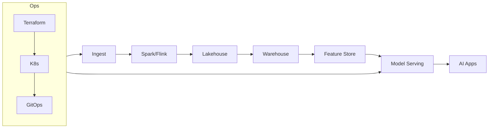

# DataEngineX (DEX)

[](https://github.com/data-literate/DEX/actions)
[](https://www.python.org/downloads/)
[](LICENSE)

A production-ready data engineering framework with medallion architecture, Airflow orchestration, and enterprise observability. DEX is both a core framework and a mono-repo for sub-projects built on top of it.

---

## Quick Start

```bash
git clone https://github.com/data-literate/DEX && cd DEX
uv lock && uv sync          # Install dependencies
uv run poe dev               # Run dev server → http://localhost:8000
uv run poe test              # Run tests
```

### Full Stack (API + Observability)

```bash
docker compose up -d
```

| Service    | URL                         |
|------------|-----------------------------|
| API        | http://localhost:8000        |
| Prometheus | http://localhost:9090        |
| Grafana    | http://localhost:3000        |
| Jaeger     | http://localhost:16686       |

---

## Project Structure

```
DEX/
├── src/
│   ├── dataenginex/           # Core framework (installable package)
│   │   ├── api/               #   FastAPI endpoints, health, errors
│   │   ├── core/              #   Schemas, validators, medallion architecture
│   │   └── middleware/        #   Logging, metrics, tracing
│   │
│   ├── careerdex/             # AI job matching & recommendations
│   │   ├── core/              #   Notifications (Slack)
│   │   ├── dags/              #   Airflow DAGs
│   │   ├── models/            #   ML models
│   │   └── phases/            #   Implementation phases
│   │
│   └── weatherdex/            # Weather prediction pipeline
│       ├── core/              #   API client & pipeline
│       ├── ml/                #   PySpark ML utilities
│       └── notebooks/         #   Jupyter notebooks
│
├── tests/                     # Test suite
│   ├── unit/                  #   Unit tests
│   └── integration/           #   End-to-end tests
│
├── infra/                     # Infrastructure
│   ├── argocd/                #   Kubernetes manifests (Kustomize + GitOps)
│   │   ├── base/              #     Base deployment, service
│   │   └── overlays/          #     dev, stage, prod overrides
│   └── monitoring/            #   Observability configs
│       ├── prometheus.yml     #     Metrics scraping
│       ├── alertmanager.yml   #     Alert routing
│       ├── alerts/            #     Alert rules
│       └── grafana/           #     Dashboards
│
├── docs/                      # Documentation
├── scripts/                   # Utility scripts
├── learning/                  # Learning experiments
│
├── Dockerfile                 # Multi-stage Docker build
├── docker-compose.yml         # Local dev stack
├── pyproject.toml             # Project config (deps, tools)
├── poe_tasks.toml             # Task runner (poe)
└── CODEOWNERS
```

---

## Architecture

**Medallion Data Pipeline:**

```
Raw Sources (LinkedIn, Indeed, Glassdoor, APIs)
             ↓
        BRONZE LAYER — Raw ingestion (Parquet)
             ↓
        SILVER LAYER — Cleaned & validated (quality ≥ 75%)
             ↓
        GOLD LAYER — Enriched & aggregated (quality ≥ 90%)
             ↓
      API / ML / Analytics
```

**Tech Stack:**

| Layer            | Technology                                      |
|------------------|-------------------------------------------------|
| Language         | Python 3.11+                                    |
| Package Manager  | uv (installs) + Poetry (build backend)          |
| Web Framework    | FastAPI + Uvicorn                               |
| Orchestration    | Apache Airflow                                  |
| ML               | PySpark                                         |
| Code Quality     | Ruff, Black, mypy (strict)                      |
| Testing          | pytest + coverage                               |
| Observability    | Prometheus, Grafana, Jaeger (OpenTelemetry)     |
| Containers       | Docker + docker compose                         |
| Kubernetes       | Kustomize + ArgoCD (GitOps)                     |
| CI/CD            | GitHub Actions                                  |

---

## Development

### Common Commands

```bash
uv run poe dev               # Dev server with hot-reload
uv run poe test              # Run all tests
uv run poe test-unit         # Unit tests only
uv run poe test-cov          # Tests with coverage report
uv run poe lint              # Lint (ruff)
uv run poe lint-fix          # Auto-fix + format
uv run poe format            # Format (ruff)
uv run poe typing            # Type check (mypy --strict)
uv run poe clean             # Remove caches & artifacts
```

### Docker

```bash
uv run poe docker-build      # Build image
uv run poe docker-up         # Start stack
uv run poe docker-down       # Stop stack
uv run poe docker-logs       # View logs
```

### Weather Pipeline

```bash
uv run poe weather-feature   # Feature engineering
uv run poe weather-train     # Train models
uv run poe weather-analyze   # Analyze predictions
```

---

## Documentation

| Guide                                             | Description              |
|---------------------------------------------------|--------------------------|
| [Documentation Hub](docs/README.md)               | Complete index           |
| [Architecture](docs/ARCHITECTURE.md)              | System design            |
| [Development](docs/DEVELOPMENT.md)                | Local setup              |
| [Contributing](docs/CONTRIBUTING.md)              | Code style, PR process   |
| [CI/CD Pipeline](docs/CI_CD.md)                   | Automation workflows     |
| [Deployment Runbook](docs/DEPLOY_RUNBOOK.md)      | Deploy & rollback        |
| [Observability](docs/OBSERVABILITY.md)            | Metrics, logs, traces    |
| [Local K8s Setup](docs/LOCAL_K8S_SETUP.md)        | Test ArgoCD locally      |
| [SDLC](docs/SDLC.md)                             | Lifecycle stages         |
| [ADRs](docs/adr/)                                 | Architecture decisions   |
| [CareerDEX](docs/careerdex/README.md)             | Job matching project     |
| [Weather](docs/weather/README.md)                 | Weather pipeline         |

---

## The DEX Philosophy

DEX bridges **Data Engineering, Warehousing, ML, AI Agents, MLOps, and DevOps** into a unified, AI-ready platform. It is the technical infrastructure that moves AI from a research notebook to production.



---

**v0.3.0** | MIT License
