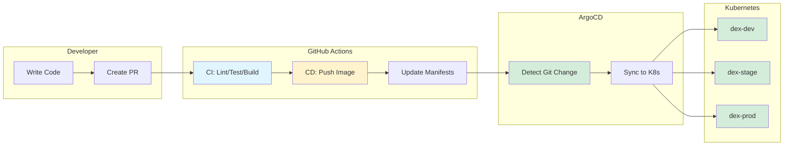

# DEX — DataEngineX

**Production-ready data engineering and ML platform** with FastAPI, automated CI/CD, and GitOps deployment.

---

## 🚀 Quick Start

**New to DEX?** Start here:
1. **[Quick Start Guide](#quick-start-local)** - Run locally in 5 minutes
2. **[Documentation Hub](docs/README.md)** - Complete documentation index
3. **[Contributing Guide](CONTRIBUTING.md)** - Development workflow

**Key Documentation:**
- **[CI/CD Pipeline](docs/CI_CD.md)** - Complete automation guide
- **[Infrastructure](infra/README.md)** - Kubernetes and ArgoCD
- **[Deployment Runbook](docs/DEPLOY_RUNBOOK.md)** - Deploy and rollback procedures

---

## 📋 Tech Stack

| Component | Technology |
|---|---|
| **Language** | Python 3.11+ |
| **Package Manager** | Poetry |
| **Web Framework** | FastAPI + Uvicorn |
| **Code Quality** | Ruff, Black, Mypy |
| **Testing** | Pytest with coverage |
| **Observability** | Prometheus, OpenTelemetry, Structlog |
| **Containers** | Docker → ghcr.io |
| **Orchestration** | Kubernetes + Kustomize |
| **GitOps** | ArgoCD (auto-sync) |
| **CI/CD** | GitHub Actions |

---

## 📁 Repository Structure

```
DEX/
├── src/dataenginex/          # FastAPI application
├── tests/                    # Unit & integration tests
├── pipelines/weather/        # Example data pipelines
├── infra/argocd/             # Kubernetes manifests (GitOps)
├── docs/                     # Documentation
├── .github/workflows/        # CI/CD automation
├── scripts/                  # Development scripts
├── pyproject.toml            # Dependencies & config
└── Dockerfile                # Container build
```

---

## 🚀 Quick Start (Local)

### Prerequisites
- Git, Python 3.11+, Poetry
- (Optional) Docker for running containerized app

### 1. Clone & Install

```bash
git clone https://github.com/data-literate/DEX
cd DEX
poetry install
```

### 2. Run the API

```bash
poetry run uvicorn dataenginex.main:app --reload
```

Visit **http://127.0.0.1:8000** to verify the health endpoint.

### 3. Run Tests

```bash
poetry run pytest -v
```

### 4. Run Code Quality Checks

```bash
poetry run ruff check src/ tests/
poetry run black --check .
poetry run mypy src/
```

## CI/CD Pipeline Overview



Every commit triggers automated CI → CD → deployment:

- **CI**: Lint, test, security scan ✓ Build image → `ghcr.io/data-literate/dex:sha-XXXXXXXX`
- **CD**: Update environment manifests → Commit to git with `[skip ci]`
- **ArgoCD**: Detect git changes → Sync to Kubernetes clusters

**For detailed pipeline documentation**, see [docs/CI_CD.md](docs/CI_CD.md)

## Multi-Environment Deployment

All three environments deploy automatically via ArgoCD:

| Environment | Replicas | Namespace | Status |
|---|---|---|---|
| **dev** | 2 | `dex-dev` | Synced & Healthy  |
| **stage** | 2 | `dex-stage` | Synced & Healthy  |
| **prod** | 3 | `dex-prod` | Synced & Healthy  |

**Branch Protection on `main`:**
- Pull request review required
- Status checks pass (CI, Security Scan)
- Branches up to date before merge
- No force pushes or deletions

## Local Kubernetes Testing

To test ArgoCD deployments locally:

```bash
# Start ArgoCD
kubectl apply -f infra/argocd/application.yaml

# Check application status
kubectl get application -n argocd

# Access ArgoCD UI
kubectl port-forward svc/argocd-server -n argocd 8080:443
# Visit https://localhost:8080
```

See [docs/LOCAL_K8S_SETUP.md](docs/LOCAL_K8S_SETUP.md) for detailed setup instructions.

---

## 📚 Documentation

**Start Here:**
- **[Documentation Hub](docs/README.md)** - Complete documentation index

**Core Guides:**
- **[CI/CD Pipeline](docs/CI_CD.md)** - Automated build, test, deploy
- **[Infrastructure Setup](infra/README.md)** - Kubernetes & ArgoCD
- **[Deployment Runbook](docs/DEPLOY_RUNBOOK.md)** - Deploy & rollback
- **[Observability](docs/OBSERVABILITY.md)** - Metrics, logs, traces

**Development:**
- **[Contributing Guide](CONTRIBUTING.md)** - Development workflow
- **[SDLC](docs/SDLC.md)** - Software lifecycle stages
- **[Local K8s Setup](docs/LOCAL_K8S_SETUP.md)** - Test ArgoCD locally

---

## Development Workflow

This repository follows a gated workflow: local checks → PR review → automated CI/CD. Work is tracked using GitHub Issues and GitHub Projects. For full lifecycle details, see [docs/SDLC.md](docs/SDLC.md).

### Day-to-Day Steps

1. Create or update a GitHub Issue and add it to the GitHub Project board
2. Create a feature branch: `git switch -c feat/short-description`
3. Implement changes and add/update tests
4. Run local checks:
	- `poetry run pytest -v`
	- `poetry run ruff check src/ tests/`
	- `poetry run black --check .`
	- `poetry run mypy src/`
5. Open a PR to `dev` and request review (deploys to dev environment)
6. After validation in dev, open a release PR from `dev` → `main`
7. Merge after required checks pass (deploys to stage/prod)

### Required Gates

- CI checks must pass (lint, formatting, type check, tests, security scan)
- At least one reviewer approval
- Branch must be up to date with the target branch (`dev` or `main`)

## Useful Commands

```bash
# Install dependencies
poetry install

# Run app locally
poetry run uvicorn dataenginex.main:app --reload

# Run tests
poetry run pytest -v

# Run all quality checks
poetry run ruff check src/ tests/
poetry run black --check .
poetry run mypy src/

# Auto-format code
poetry run black .

# Build Docker image locally
docker build -t dex:latest .

# Run Docker image
docker run -p 8000:8000 dex:latest
```

## Next Steps

1. **For local development**: Follow the Quick Start above
2. **For Kubernetes/ArgoCD testing**: See [docs/LOCAL_K8S_SETUP.md](docs/LOCAL_K8S_SETUP.md)
3. **For infrastructure details**: See [infra/README.md](infra/README.md)
4. **For contributing code**: See [CONTRIBUTING.md](CONTRIBUTING.md)

---

**Status**: Production-ready CI/CD pipeline  | All environments synced & healthy  | Ready for development 

