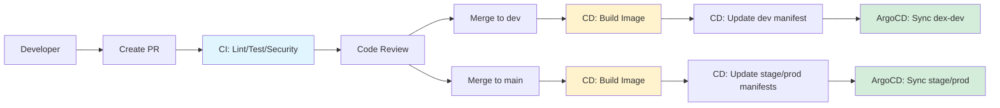
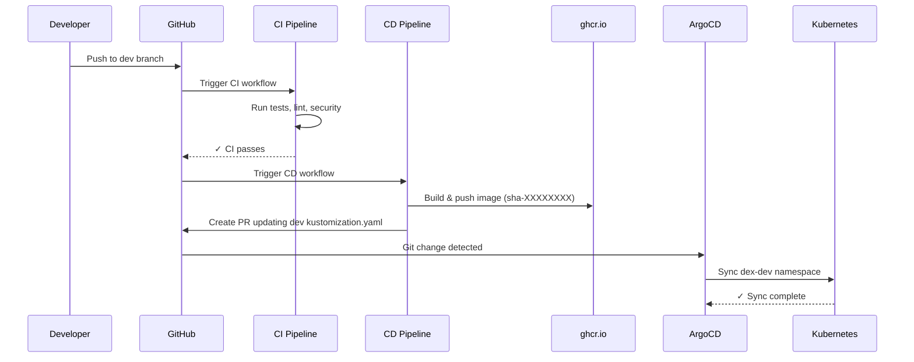
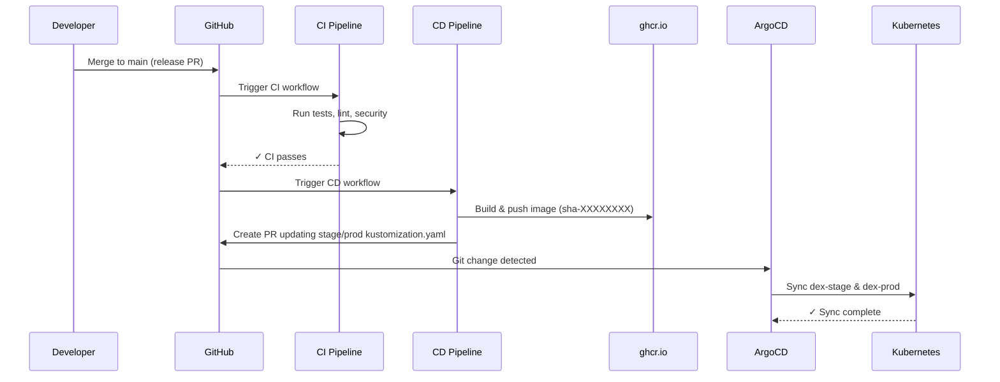
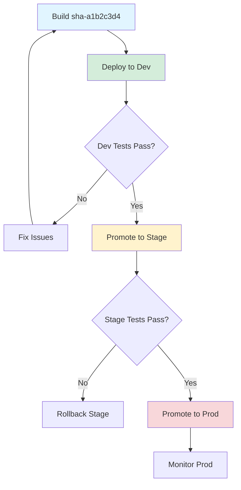

# CI/CD Pipeline

**Complete guide to DataEngineX continuous integration and deployment automation.**

> **Quick Links:** [CI Workflow](#continuous-integration-ci) · [CD Workflow](#continuous-deployment-cd) · [PR Previews](#pr-preview-environments) · [Troubleshooting](#troubleshooting) · [Quick Reference](#quick-reference)

---

## 📋 Table of Contents

- [Overview](#overview)
- [Continuous Integration (CI)](#continuous-integration-ci)
- [Continuous Deployment (CD)](#continuous-deployment-cd)
- [PR Preview Environments](#pr-preview-environments)
- [Deployment Flow](#deployment-flow)
- [GitOps with ArgoCD](#gitops-with-argocd)
- [Image Promotion Strategy](#image-promotion-strategy)
- [Rollback Procedures](#rollback-procedures)
- [Pipeline Metrics](#pipeline-metrics)
- [Troubleshooting](#troubleshooting)
- [Best Practices](#best-practices)
- [Related Documentation](#related-documentation)
- [Quick Reference](#quick-reference)

---

## Overview

DEX uses a GitOps-based CI/CD pipeline with:
- **CI**: Automated testing, linting, and security scanning on every PR
- **CD**: Automated Docker builds and deployment manifest updates
- **ArgoCD**: GitOps-based continuous deployment to Kubernetes



## Continuous Integration (CI)

**Workflow**: [`.github/workflows/ci.yml`](../.github/workflows/ci.yml)

**Triggers**:
- Push to `main` or `dev` branches
- Pull requests targeting `main` or `dev`

**Jobs**:

### 1. Lint and Test
Runs code quality checks and test suite:

```bash
# Linting
uv run poe lint

# Tests with coverage
uv run poe test-cov
```

**Requirements**: All checks must pass before merge

### 2. Security Scans
Runs in parallel via [`.github/workflows/security.yml`](../.github/workflows/security.yml):

- **CodeQL**: Static analysis for security vulnerabilities
- **Semgrep**: OWASP Top 10 and best practice checks

**Results**: Available in GitHub Security tab

## Continuous Deployment (CD)

**Workflow**: [`.github/workflows/cd.yml`](../.github/workflows/cd.yml)

**Trigger**: After successful CI run on `main` or `dev` branches

**Jobs**:

### 1. Build and Push Docker Image

Builds immutable Docker image with SHA tag:

```bash
# Image naming convention
ghcr.io/data-literate/dex:sha-<8-char-commit-sha>

# Example
ghcr.io/data-literate/dex:sha-a1b2c3d4
```

**Tags Applied**:
- `sha-XXXXXXXX` - Immutable SHA tag (always)
- `latest` - Latest main branch build (main only)

**Registry**: GitHub Container Registry (ghcr.io)

**Build Cache**: GitHub Actions cache for faster builds

### 2. Update Dev Manifest (dev branch only)

Automatically updates dev environment when changes merge to `dev`:

```yaml
# Updates: infra/argocd/overlays/dev/kustomization.yaml
images:
  - name: data-literate/dex
    newTag: sha-a1b2c3d4  # ← Updated by CD
```

**PR Title**: `chore: update dev image to sha-XXXXXXXX`

**Result**: ArgoCD detects change and syncs `dex-dev` namespace

### 3. Update Stage/Prod Manifests (main branch only)

Automatically updates stage and prod when changes merge to `main`:

```yaml
# Updates: 
# - infra/argocd/overlays/stage/kustomization.yaml
# - infra/argocd/overlays/prod/kustomization.yaml

images:
  - name: data-literate/dex
    newTag: sha-a1b2c3d4  # ← Updated by CD
```

**PR Title**: `chore: update stage/prod image to sha-XXXXXXXX`

**Result**: ArgoCD syncs `dex-stage` and `dex-prod` namespaces

### 4. Security Scan

Runs Trivy vulnerability scan on built image:

```bash
trivy image ghcr.io/data-literate/dex:sha-XXXXXXXX
```

**Results**: Uploaded to GitHub Security tab as SARIF report

**Severity Thresholds**:
- CRITICAL: Block deployment (manual review required)
- HIGH: Alert but allow deployment
- MEDIUM/LOW: Informational

## PR Preview Environments

**Workflow**: [`.github/workflows/pr-preview.yaml`](../.github/workflows/pr-preview.yaml)

**Trigger**: Add `preview` label to pull request

**Purpose**: Deploy isolated preview environment for testing

### How It Works

1. **Label PR** with `preview`:
   ```bash
   gh pr edit <pr-number> --add-label preview
   ```

2. **CI builds preview image**:
   ```
   ghcr.io/data-literate/dex:sha-XXXXXXXX
   ghcr.io/data-literate/dex:pr-###
   ```

3. **ArgoCD creates preview namespace**:
   ```
   dex-pr-###
   ```

4. **Access preview**:
   ```bash
   kubectl port-forward -n dex-pr-42 svc/dex 8000:8000
   curl http://localhost:8000/health
   ```

5. **Auto-cleanup**: When PR closes, ArgoCD deletes namespace

### Preview Benefits

- Test changes in realistic Kubernetes environment
- Validate database migrations safely
- Test integration with external services
- Share working demos with stakeholders

## Deployment Flow

### Dev Environment Flow



### Stage/Prod Environment Flow



## GitOps with ArgoCD

### ArgoCD Applications

```yaml
# Dev application
apiVersion: argoproj.io/v1alpha1
kind: Application
metadata:
  name: dex-dev
spec:
  source:
    repoURL: https://github.com/data-literate/DEX
    targetRevision: dev  # ← Tracks dev branch
    path: infra/argocd/overlays/dev
  destination:
    namespace: dex-dev
  syncPolicy:
    automated:
      prune: true
      selfHeal: true
```

```yaml
# Stage/Prod applications
apiVersion: argoproj.io/v1alpha1
kind: Application
metadata:
  name: dex-stage
spec:
  source:
    repoURL: https://github.com/data-literate/DEX
    targetRevision: main  # ← Tracks main branch
    path: infra/argocd/overlays/stage
  destination:
    namespace: dex-stage
  syncPolicy:
    automated:
      prune: true
      selfHeal: true
```

### Sync Policies

- **Auto-sync**: Enabled for all environments
- **Self-heal**: ArgoCD automatically corrects manual kubectl changes
- **Prune**: Removes resources deleted from git

### Monitoring Deployments

```bash
# Watch ArgoCD sync status
argocd app get dex-dev
argocd app get dex-stage
argocd app get dex-prod

# View sync history
argocd app history dex-dev

# Manual sync (if needed)
argocd app sync dex-dev --prune
```

## Image Promotion Strategy

### Why SHA Tags?

- **Immutable**: Same image from dev → stage → prod
- **Traceable**: Links to exact git commit
- **Auditable**: Clear promotion history in git
- **Rollback-friendly**: Easy to revert to previous SHA

### Promotion Flow



### Manual Promotion (Stage → Prod)

While dev and stage are auto-deployed, prod may require manual promotion for control:

```bash
# 1. Verify image in stage
IMAGE_TAG="sha-a1b2c3d4"
kubectl get deployment -n dex-stage -o jsonpath='{.spec.template.spec.containers[0].image}'

# 2. Update prod kustomization
sed -i "s|newTag:.*|newTag: $IMAGE_TAG|g" infra/argocd/overlays/prod/kustomization.yaml

# 3. Create promotion PR
git checkout -b promote-prod-$IMAGE_TAG
git add infra/argocd/overlays/prod/kustomization.yaml
git commit -m "chore: promote $IMAGE_TAG to prod"
git push origin promote-prod-$IMAGE_TAG
gh pr create --title "Promote $IMAGE_TAG to Production" --body "Promoting verified image from stage"

# 4. Merge PR → ArgoCD syncs prod
```

Or use the promotion script:

```bash
# Automated promotion
.\scripts\promote.ps1 -FromEnv stage -ToEnv prod -ImageTag sha-a1b2c3d4
```

## Rollback Procedures

### Quick Rollback (Dev)

```bash
# Find previous image
git log --oneline infra/argocd/overlays/dev/kustomization.yaml

# Revert to previous commit
git revert HEAD
git push origin dev

# ArgoCD auto-syncs to previous image
```

### Controlled Rollback (Stage/Prod)

```bash
# 1. Identify last good image
LAST_GOOD="sha-xyz78901"
git log infra/argocd/overlays/prod/kustomization.yaml

# 2. Update to last good image
sed -i "s|newTag:.*|newTag: $LAST_GOOD|g" infra/argocd/overlays/prod/kustomization.yaml

# 3. Emergency commit to main
git add infra/argocd/overlays/prod/kustomization.yaml
git commit -m "fix: rollback prod to $LAST_GOOD"
git push origin main

# ArgoCD syncs within 3 minutes (or force sync)
argocd app sync dex-prod
```

### Emergency Manual Rollback

If ArgoCD is unavailable:

```bash
# Direct kubectl update
kubectl set image deployment/dex dex=ghcr.io/data-literate/dex:sha-xyz78901 -n dex-prod
kubectl rollout status deployment/dex -n dex-prod

# Update git to match (after recovery)
```

## Pipeline Metrics

### Build Times

- **CI (Lint + Test)**: ~2 minutes
- **Docker Build**: ~3 minutes (with cache)
- **ArgoCD Sync**: ~30 seconds

**Total Dev Deployment**: ~6 minutes from merge

### Success Rates (Target)

- **CI Pass Rate**: >95%
- **CD Success Rate**: >99%
- **Deployment Success Rate**: >99%

### Monitoring

```bash
# Recent CI runs
gh run list --workflow ci.yml --limit 10

# Recent deployments
argocd app history dex-dev --limit 10

# Failed builds
gh run list --workflow cd.yml --status failure
```

## Troubleshooting

### CI Fails with Lint Errors

```bash
# Run lint checks locally
uv run poe lint

# Auto-fix
uv run poe lint-fix
```

### Image Not Building

```bash
# Check CD workflow logs
gh run view --log

# Verify Docker build locally
docker build -t dex:local .

# Check registry authentication
echo $GITHUB_TOKEN | docker login ghcr.io -u USERNAME --password-stdin
```

### ArgoCD Not Syncing

```bash
# Check application status
argocd app get dex-dev

# View recent sync errors
argocd app get dex-dev --refresh

# Force sync
argocd app sync dex-dev --prune --force

# Check git repo connection
argocd repo list
```

### Image Not Updating in Kubernetes

```bash
# Verify image in kustomization
cat infra/argocd/overlays/dev/kustomization.yaml

# Check if ArgoCD sees the change
argocd app diff dex-dev

# Verify image exists in registry
docker pull ghcr.io/data-literate/dex:sha-XXXXXXXX

# Check pod image
kubectl get pod -n dex-dev -o jsonpath='{.items[0].spec.containers[0].image}'
```

## Security Considerations

### Image Scanning

- **Pre-deployment**: Trivy scan in CD pipeline
- **Runtime**: Falco monitors container behavior
- **Registry**: GHCR vulnerability scanning enabled

### Secrets Management

- **Never commit secrets** to git
- **Use Kubernetes Secrets** for runtime config
- **Rotate regularly**: Database credentials, API keys

### Supply Chain Security

- **Signed commits**: Required for prod deployments
- **SBOM**: Generated with each build
- **Provenance**: Image build attestation

## Best Practices

### Development Workflow

1. **Create feature branch** from `dev`
2. **Develop and test locally**
3. **Run lint checks** before committing: `ruff`, `black`, `mypy`, `pytest`
4. **Create PR** targeting `dev`
5. **Wait for CI** to pass
6. **Get code review** approval
7. **Merge to dev** → Auto-deploys to dev environment
8. **Verify in dev** environment
9. **Create release PR** from `dev` → `main`
10. **Merge to main** → Auto-deploys to stage/prod

### Commit Messages

Use conventional commits for clarity:

```bash
feat: add new endpoint for data processing
fix: resolve memory leak in pipeline
chore: update dependencies
docs: improve deployment runbook
test: add integration tests for API
```

### PR Guidelines

- **Keep PRs small**: <500 lines of code
- **Single purpose**: One feature/fix per PR
- **Test coverage**: Include tests for new code
- **Documentation**: Update docs for API changes
- **Preview**: Use `preview` label for complex changes

### Deployment Safety

- **Deploy during business hours** (for stage/prod)
- **Monitor for 15 minutes** after deployment
- **Keep rollback plan ready**
- **Communicate** in team channel before prod deploy

## CI/CD Evolution

### Current State ✅

- [x] Automated CI with lint, test, type checks
- [x] Automated CD with Docker builds
- [x] GitOps deployment with ArgoCD
- [x] PR preview environments
- [x] Security scanning (CodeQL, Trivy, Semgrep)
- [x] Automated dev deployments
- [x] Automated stage/prod deployments

### Future Enhancements 🚀

- [ ] **Canary deployments**: Gradual rollout to prod
- [ ] **Blue-green deployments**: Zero-downtime releases
- [ ] **E2E smoke tests**: Post-deployment validation
- [ ] **Performance testing**: Load tests in stage
- [ ] **SonarCloud integration**: Code quality gates
- [ ] **Slack notifications**: Deployment status updates
- [ ] **Automated rollback**: On health check failures
- [ ] **Release notes**: Auto-generated from commits

## Related Documentation

**Next Steps:**
- **[Deployment Runbook](DEPLOY_RUNBOOK.md)** - Deploy and rollback procedures
- **[Infrastructure Guide](../infra/README.md)** - Kubernetes & ArgoCD setup
- **[Observability](OBSERVABILITY.md)** - Monitor deployments

**Related Topics:**
- **[SDLC Overview](SDLC.md)** - Development lifecycle
- **[Local K8s Setup](LOCAL_K8S_SETUP.md)** - Test locally
- **[Contributing Guide](../CONTRIBUTING.md)** - Development workflow

---

## Quick Reference

```bash
# Local development
uv lock
uv sync
uv run poe test
uv run poe lint

# Create PR
gh pr create --title "feat: add feature" --body "Description"

# Add preview environment
gh pr edit <pr-number> --add-label preview

# Check CI status
gh pr checks <pr-number>

# View CD logs
gh run list --workflow cd.yml
gh run view <run-id> --log

# Monitor deployments
argocd app get dex-dev
kubectl get pods -n dex-dev
kubectl logs -n dex-dev -l app=dex -f

# Promote to production
.\scripts\promote.ps1 -FromEnv stage -ToEnv prod

# Rollback
git revert HEAD
git push origin dev  # or main
```

---

**[← Back to Documentation Hub](README.md)**
