# CI/CD Pipeline

**Complete guide to DataEngineX continuous integration and deployment automation.**

> **Quick Links:** [CI Workflow](#continuous-integration-ci) · [CD Workflow](#continuous-deployment-cd) · [Troubleshooting](#troubleshooting) · [Quick Reference](#quick-reference)

---

## 📋 Table of Contents

- [Overview](#overview)
- [Origin: Dual-Project Structure](#project-structure)
- [Continuous Integration (CI)](#continuous-integration-ci)
- [Continuous Deployment (CD)](#continuous-deployment-cd)
- [Release Automation (Matrix Approach)](#release-automation-matrix-approach)
- [PyPI Publishing](#pypi-publishing)
- [Deployment Flow](#deployment-flow)
- [GitOps with ArgoCD](#gitops-with-argocd)
- [Image Promotion Strategy](#image-promotion-strategy)
- [Rollback Procedures](#rollback-procedures)
- [Pipeline Metrics](#pipeline-metrics)
- [CI/CD Evolution](#cicd-evolution)
- [Troubleshooting](#troubleshooting)
- [Best Practices](#best-practices)
- [Related Documentation](#related-documentation)
- [Quick Reference](#quick-reference)

---

## Overview

DEX uses a GitOps-based CI/CD pipeline with:
- **CI**: Automated testing, linting, and security scanning on every PR
- **CD**: Automated Docker builds and deployment manifest updates
- **ArgoCD**: GitOps-based continuous deployment to Kubernetes


---

## Project Structure

DEX is **dual-project**:

| Component | Location | Purpose | Release |
|-----------|----------|---------|---------|
| **DataEngineX** (core) | `packages/dataenginex/` | Core framework (API, middleware, storage) | PyPI (independently versioned) |
| **CareerDEX** (app) | `src/careerdex/` | Job matching application | Docker app (versioned with root `pyproject.toml`) |

### Unified Testing

The **root `pyproject.toml`** orchestrates all tests:
- Imports `dataenginex>=0.4.0` as a dependency (editable path: `packages/dataenginex`)
- Defines app packages under `[[tool.poetry.packages]] include = "careerdex"`
- Declares dependency groups: `dev` (required), `data` (PySpark/Airflow), `notebook` (pandas)

**CI workflow** (`ci.yml`) runs both projects together in a single pipeline:
- `lint-and-test` job: `uv sync` + `poe lint/test-cov` (tests both dataenginex + careerdex with dev deps only)
- `integration-test` job (optional, label/dispatch): `uv sync --group data --group notebook` (full stack)

### Separate Validation

- **Package validation** (`package-validation.yml`): Watches `packages/dataenginex/**` only → builds wheel + twine check
- **Release automation** (matrix):
  - `release-dataenginex.yml`: Watches `packages/dataenginex/pyproject.toml` for version changes → creates `dataenginex-vX.Y.Z` tag + release
  - `release-careerdex.yml`: Watches root `pyproject.toml` for version changes → creates `careerdex-vX.Y.Z` tag + release
- **PyPI publishing** (`pypi-publish.yml`): Triggered by DataEngineX release → detects changes in `packages/dataenginex/` since last tag → publishes to PyPI

---

## Continuous Integration (CI)

**Workflow**: [`.github/workflows/ci.yml`](../.github/workflows/ci.yml)

**Triggers**:
- Push to `main` or `dev` branches
- Pull requests targeting `main` or `dev`

**Jobs**:

### 1. Lint and Test
Runs code quality checks and test suite:

```bash
# Linting
uv run poe lint

# Tests with coverage
uv run poe test-cov
```

**Requirements**: All checks must pass before merge

### 2. Security Scans
Runs in parallel via [`.github/workflows/security.yml`](../.github/workflows/security.yml):

- **CodeQL**: Static analysis for security vulnerabilities
- **Semgrep**: OWASP Top 10 and best practice checks

**Results**: Available in GitHub Security tab

### 3. Integration Test (Optional)
Optional job for full dependency coverage (PySpark, Airflow, Pandas):

**Trigger**:
- Manual: `gh workflow run ci.yml`
- Label: Add `full-test` label to pull request

**What it does**:
```bash
# Installs all dependency groups
uv sync --group dev --group data --group notebook

# Runs full test suite (may take longer)
uv run poe test-cov
```

**Use case**: Validate changes to data pipelines, ML models, or when adding new dependencies to `data` or `notebook` groups.

## Continuous Deployment (CD)

**Workflow**: [`.github/workflows/cd.yml`](../.github/workflows/cd.yml)

**Trigger**: After successful CI run on `main` or `dev` branches

**Jobs**:

### 1. Build and Push Docker Image

Builds immutable Docker image with SHA tag:

```bash
# Image naming convention
ghcr.io/thedataenginex/dex:sha-<8-char-commit-sha>

# Example
ghcr.io/thedataenginex/dex:sha-a1b2c3d4
```

**Tags Applied**:
- `sha-XXXXXXXX` - Immutable SHA tag (always)
- `latest` - Latest main branch build (main only)

**Registry**: GitHub Container Registry (ghcr.io)

**Build Cache**: GitHub Actions cache for faster builds

### 2. Update Dev Manifest (dev branch only)

Automatically updates dev environment when changes merge to `dev`:

```yaml
# Updates: infra/argocd/overlays/dev/kustomization.yaml
images:
  - name: thedataenginex/dex
    newTag: sha-a1b2c3d4  # ← Updated by CD
```

**PR Title**: `chore: update dev image to sha-XXXXXXXX`

**Result**: ArgoCD detects change and syncs `dex-dev` namespace

### 3. Update Stage/Prod Manifests (main branch only)

Automatically updates stage and prod when changes merge to `main`:

```yaml
# Updates: 
# - infra/argocd/overlays/stage/kustomization.yaml
# - infra/argocd/overlays/prod/kustomization.yaml

images:
  - name: thedataenginex/dex
    newTag: sha-a1b2c3d4  # ← Updated by CD
```

**PR Title**: `chore: update stage/prod image to sha-XXXXXXXX`

**Result**: ArgoCD syncs `dex-stage` and `dex-prod` namespaces

### 4. Security Scan

Runs Trivy vulnerability scan on built image:

```bash
trivy image ghcr.io/thedataenginex/dex:sha-XXXXXXXX
```

**Results**: Uploaded to GitHub Security tab as SARIF report

**Severity Thresholds**:
- CRITICAL: Block deployment (manual review required)
- HIGH: Alert but allow deployment
- MEDIUM/LOW: Informational

## Release Automation (Matrix Approach)

DEX uses **parallel, independent release workflows** for each package:

### DataEngineX Releases

**Workflow**: [`.github/workflows/release-dataenginex.yml`](../.github/workflows/release-dataenginex.yml)

**Trigger**: Version change in `packages/dataenginex/pyproject.toml` on `main` branch

**What it does**:
1. Detects version bump in `packages/dataenginex/pyproject.toml`
2. Extracts version (e.g., `0.4.11`)
3. Creates git tag: `dataenginex-v0.4.11`
4. Creates GitHub release → **automatically triggers `pypi-publish.yml`**
5. Publishes to TestPyPI/PyPI

**How to release DataEngineX**:
```bash
# Update version in packages/dataenginex/pyproject.toml
version = "0.4.11"

# Commit and push
git add packages/dataenginex/pyproject.toml
git commit -m "chore: bump dataenginex to 0.4.11"
git push origin main
```

### CareerDEX Releases

**Workflow**: [`.github/workflows/release-careerdex.yml`](../.github/workflows/release-careerdex.yml)

**Trigger**: Version change in root `pyproject.toml` on `main` branch

**What it does**:
1. Detects version bump in root `pyproject.toml`
2. Extracts version (e.g., `0.3.6`)
3. Creates git tag: `careerdex-v0.3.6`
4. Creates GitHub release for the app
5. No PyPI publish (app is Docker-based, not a library)

**How to release CareerDEX**:
```bash
# Update version in root pyproject.toml
version = "0.3.6"

# Commit and push
git add pyproject.toml
git commit -m "chore: bump careerdex to 0.3.6"
git push origin main
```

### Release Workflow (Old)

**Deprecated**: [`.github/workflows/release.yml`](../.github/workflows/release.yml) — replaced by matrix workflows above.

Not monitored in current setup. Can be removed or kept for backward compatibility.

## PyPI Publishing

**Workflow**: [`.github/workflows/pypi-publish.yml`](../.github/workflows/pypi-publish.yml)

**Trigger**: GitHub release published (from `release-dataenginex.yml`)

**What it does**:
1. Receives GitHub release event from DataEngineX release
2. Detects if files under `packages/dataenginex/` actually changed since previous `dataenginex-vX.Y.Z` tag
3. If changes found:
   - Builds wheel distributions
   - Publishes to TestPyPI (dry-run)
   - Promotes to PyPI (stable semver tags only, not pre-release)
4. If no changes: skips publishing with informational message

**Publish gates**:
- Only publishes if code actually changed (not just version bump in other files)
- TestPyPI first for dry-run verification
- PyPI promotion requires stable semver: `vMAJOR.MINOR.PATCH` (not `v1.2.3-rc1`)
- Pre-release tags: publish to TestPyPI only

**Automatic flow**:
```
DataEngineX version bump → release-dataenginex.yml → GitHub release → pypi-publish.yml → PyPI
```

**Manual trigger** (if needed):
```bash
gh workflow run pypi-publish.yml -f tag=dataenginex-v0.4.11
```

## Deployment Flow

### Dev Environment Flow


### Stage/Prod Environment Flow

```mermaid
sequenceDiagram
    participant Dev as Developer
    participant GH as GitHub
    participant CI as CI Pipeline
    participant CD as CD Pipeline
    participant GHCR as ghcr.io
    participant Argo as ArgoCD
    participant K8s as Kubernetes

    Dev->>GH: Merge to main (release PR)
    GH->>CI: Trigger CI workflow
    CI->>CI: Run tests, lint, security
    CI-->>GH: ✓ CI passes
    GH->>CD: Trigger CD workflow
    CD->>GHCR: Build & push image (sha-XXXXXXXX)
    CD->>GH: Create PR updating stage/prod kustomization.yaml
    GH->>Argo: Git change detected
    Argo->>K8s: Sync dex-stage & dex-prod
    K8s-->>Argo: ✓ Sync complete
```



## GitOps with ArgoCD

### ArgoCD Applications

```yaml
# Dev application
apiVersion: argoproj.io/v1alpha1
kind: Application
metadata:
  name: dex-dev
spec:
  source:
    repoURL: https://github.com/TheDataEngineX/DEX
    targetRevision: dev  # ← Tracks dev branch
    path: infra/argocd/overlays/dev
  destination:
    namespace: dex-dev
  syncPolicy:
    automated:
      prune: true
      selfHeal: true
```

```yaml
# Stage/Prod applications
apiVersion: argoproj.io/v1alpha1
kind: Application
metadata:
  name: dex-stage
spec:
  source:
    repoURL: https://github.com/TheDataEngineX/DEX
    targetRevision: main  # ← Tracks main branch
    path: infra/argocd/overlays/stage
  destination:
    namespace: dex-stage
  syncPolicy:
    automated:
      prune: true
      selfHeal: true
```

### Sync Policies

- **Auto-sync**: Enabled for all environments
- **Self-heal**: ArgoCD automatically corrects manual kubectl changes
- **Prune**: Removes resources deleted from git

### Monitoring Deployments

```bash
# Watch ArgoCD sync status
argocd app get dex-dev
argocd app get dex-stage
argocd app get dex-prod

# View sync history
argocd app history dex-dev

# Manual sync (if needed)
argocd app sync dex-dev --prune
```

## Image Promotion Strategy

### Why SHA Tags?

- **Immutable**: Same image from dev → stage → prod
- **Traceable**: Links to exact git commit
- **Auditable**: Clear promotion history in git
- **Rollback-friendly**: Easy to revert to previous SHA

### Promotion Flow


### Manual Promotion (Stage → Prod)

While dev and stage are auto-deployed, prod may require manual promotion for control:

```bash
# 1. Verify image in stage
IMAGE_TAG="sha-a1b2c3d4"
kubectl get deployment -n dex-stage -o jsonpath='{.spec.template.spec.containers[0].image}'

# 2. Update prod kustomization
sed -i "s|newTag:.*|newTag: $IMAGE_TAG|g" infra/argocd/overlays/prod/kustomization.yaml

# 3. Create promotion PR
git checkout -b promote-prod-$IMAGE_TAG
git add infra/argocd/overlays/prod/kustomization.yaml
git commit -m "chore: promote $IMAGE_TAG to prod"
git push origin promote-prod-$IMAGE_TAG
gh pr create --title "Promote $IMAGE_TAG to Production" --body "Promoting verified image from stage"

# 4. Merge PR → ArgoCD syncs prod
```

Or use the promotion script:

```bash
# Automated promotion
./scripts/promote.sh --from-env stage --to-env prod --image-tag sha-a1b2c3d4
```

## Rollback Procedures

### Quick Rollback (Dev)

```bash
# Find previous image
git log --oneline infra/argocd/overlays/dev/kustomization.yaml

# Revert to previous commit
git revert HEAD
git push origin dev

# ArgoCD auto-syncs to previous image
```

### Controlled Rollback (Stage/Prod)

```bash
# 1. Identify last good image
LAST_GOOD="sha-xyz78901"
git log infra/argocd/overlays/prod/kustomization.yaml

# 2. Update to last good image
sed -i "s|newTag:.*|newTag: $LAST_GOOD|g" infra/argocd/overlays/prod/kustomization.yaml

# 3. Emergency commit to main
git add infra/argocd/overlays/prod/kustomization.yaml
git commit -m "fix: rollback prod to $LAST_GOOD"
git push origin main

# ArgoCD syncs within 3 minutes (or force sync)
argocd app sync dex-prod
```

### Emergency Manual Rollback

If ArgoCD is unavailable:

```bash
# Direct kubectl update
kubectl set image deployment/dex dex=ghcr.io/thedataenginex/dex:sha-xyz78901 -n dex-prod
kubectl rollout status deployment/dex -n dex-prod

# Update git to match (after recovery)
```

## Pipeline Metrics

### Build Times

- **CI (Lint + Test)**: ~2 minutes
- **Docker Build**: ~3 minutes (with cache)
- **ArgoCD Sync**: ~30 seconds

**Total Dev Deployment**: ~6 minutes from merge

### Success Rates (Target)

- **CI Pass Rate**: >95%
- **CD Success Rate**: >99%
- **Deployment Success Rate**: >99%

### Monitoring

```bash
# Recent CI runs
gh run list --workflow ci.yml --limit 10

# Recent deployments
argocd app history dex-dev --limit 10

# Failed builds
gh run list --workflow cd.yml --status failure
```

## Troubleshooting

### CI Fails with Lint Errors

```bash
# Run lint checks locally
uv run poe lint

# Auto-fix
uv run poe lint-fix
```

### Image Not Building

```bash
# Check CD workflow logs
gh run view --log

# Verify Docker build locally
docker build -t dex:local .

# Check registry authentication
echo $GITHUB_TOKEN | docker login ghcr.io -u USERNAME --password-stdin
```

### ArgoCD Not Syncing

```bash
# Check application status
argocd app get dex-dev

# View recent sync errors
argocd app get dex-dev --refresh

# Force sync
argocd app sync dex-dev --prune --force

# Check git repo connection
argocd repo list
```

### Image Not Updating in Kubernetes

```bash
# Verify image in kustomization
cat infra/argocd/overlays/dev/kustomization.yaml

# Check if ArgoCD sees the change
argocd app diff dex-dev

# Verify image exists in registry
docker pull ghcr.io/thedataenginex/dex:sha-XXXXXXXX

# Check pod image
kubectl get pod -n dex-dev -o jsonpath='{.items[0].spec.containers[0].image}'
```

## Security Considerations

### Image Scanning

- **Pre-deployment**: Trivy scan in CD pipeline
- **Runtime**: Falco monitors container behavior
- **Registry**: GHCR vulnerability scanning enabled

### Secrets Management

- **Never commit secrets** to git
- **Use Kubernetes Secrets** for runtime config
- **Rotate regularly**: Database credentials, API keys

### Supply Chain Security

- **Signed commits**: Required for prod deployments
- **SBOM**: Generated with each build
- **Provenance**: Image build attestation

## Best Practices

### Development Workflow

1. **Create feature branch** from `dev`
2. **Develop and test locally**
3. **Run quality checks** before committing: `uv run poe lint`, `uv run poe typecheck`, `uv run poe test`
4. **Create PR** targeting `dev`
5. **Wait for CI** to pass
6. **Get code review** approval
7. **Merge to dev** → Auto-deploys to dev environment
8. **Verify in dev** environment
9. **Create release PR** from `dev` → `main`
10. **Merge to main** → Auto-deploys to stage/prod

### Commit Messages

Use conventional commits for clarity:

```bash
feat: add new endpoint for data processing
fix: resolve memory leak in pipeline
chore: update dependencies
docs: improve deployment runbook
test: add integration tests for API
```

### PR Guidelines

- **Keep PRs small**: <500 lines of code
- **Single purpose**: One feature/fix per PR
- **Test coverage**: Include tests for new code
- **Documentation**: Update docs for API changes

### Deployment Safety

- **Deploy during business hours** (for stage/prod)
- **Monitor for 15 minutes** after deployment
- **Keep rollback plan ready**
- **Communicate** in team channel before prod deploy

## CI/CD Evolution

### Current State ✅

- [x] Automated CI with lint, test, type checks
- [x] Automated CD with Docker builds
- [x] GitOps deployment with ArgoCD
- [x] Security scanning (CodeQL, Trivy, Semgrep)
- [x] Automated dev deployments
- [ ] Automated stage/prod manifest updates

### Future Enhancements 🚀

- [ ] **Canary deployments**: Gradual rollout to prod
- [ ] **Blue-green deployments**: Zero-downtime releases
- [ ] **E2E smoke tests**: Post-deployment validation
- [ ] **Performance testing**: Load tests in stage
- [ ] **SonarCloud integration**: Code quality gates
- [ ] **Slack notifications**: Deployment status updates
- [ ] **Automated rollback**: On health check failures
- [ ] **Release notes**: Auto-generated from commits

## Related Documentation

**Next Steps:**
- **[Deployment Runbook](DEPLOY_RUNBOOK.md)** - Deploy and rollback procedures
- **[Infrastructure Guide](../infra/README.md)** - Kubernetes & ArgoCD setup
- **[Observability](OBSERVABILITY.md)** - Monitor deployments

**Related Topics:**
- **[SDLC Overview](SDLC.md)** - Development lifecycle
- **[Local K8s Setup](LOCAL_K8S_SETUP.md)** - Test locally
- **[Contributing Guide](../CONTRIBUTING.md)** - Development workflow

---

## Quick Reference

### Workflows Overview

| Workflow | Trigger | Purpose | File |
|----------|---------|---------|------|
| **CI** (Primary) | `push main/dev`, PRs to main/dev | Lint, test, type-check (dev deps) | [.github/workflows/ci.yml](../.github/workflows/ci.yml) |
| **CI** (Integration) | PR label `full-test` or manual dispatch | Full test (data + notebook groups) | [.github/workflows/ci.yml](../.github/workflows/ci.yml) |
| **Security** | `push main/dev`, PRs to main/dev | CodeQL + Semgrep scans | [.github/workflows/security.yml](../.github/workflows/security.yml) |
| **Package** | Changes to `packages/dataenginex/**` | Build wheel + twine check (dataenginex only) | [.github/workflows/package-validation.yml](../.github/workflows/package-validation.yml) |
| **CD** | After CI success on main/dev | Build Docker image, push to ghcr.io | [.github/workflows/cd.yml](../.github/workflows/cd.yml) |
| **Release DataEngineX** | Version change in `packages/dataenginex/pyproject.toml` on main | Extract version, create `dataenginex-vX.Y.Z` tag + release | [.github/workflows/release-dataenginex.yml](../.github/workflows/release-dataenginex.yml) |
| **Release CareerDEX** | Version change in root `pyproject.toml` on main | Extract version, create `careerdex-vX.Y.Z` tag + release | [.github/workflows/release-careerdex.yml](../.github/workflows/release-careerdex.yml) |
| **PyPI Publish** | GitHub release (DataEngineX) published | Detect changes + publish dataenginex to TestPyPI/PyPI | [.github/workflows/pypi-publish.yml](../.github/workflows/pypi-publish.yml) |

### Local Commands

```bash
# Local development
uv lock
uv sync
uv run poe test
uv run poe lint

# Local with all dependencies (data + notebook)
uv sync --group data --group notebook
uv run poe test-cov

# Create PR
gh pr create --title "feat: add feature" --body "Description"

# Trigger optional integration tests
gh pr edit <pr-number> --add-label full-test

# Check CI status
gh pr checks <pr-number>

# View CD logs
gh run list --workflow cd.yml
gh run view <run-id> --log

# Monitor deployments
argocd app get dex-dev
kubectl get pods -n dex-dev
kubectl logs -n dex-dev -l app=dex -f

# Promote to production
./scripts/promote.sh --from-env stage --to-env prod

# Rollback
git revert HEAD
git push origin dev  # or main
```

---

**[← Back to Documentation Hub](README.md)**
