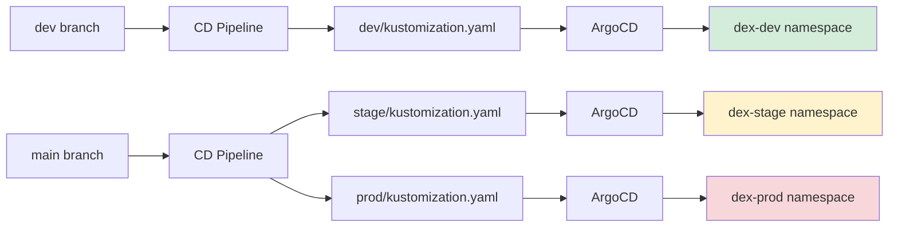
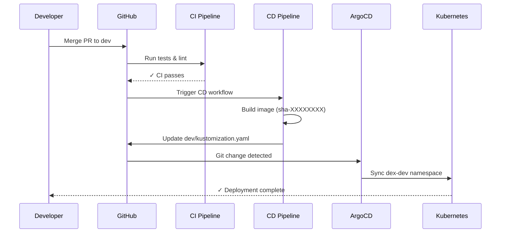
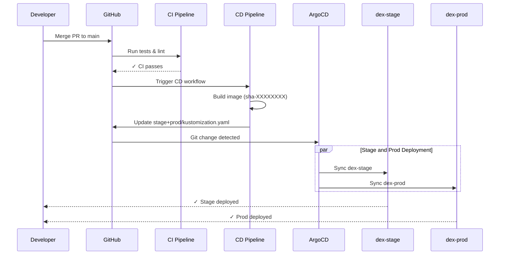
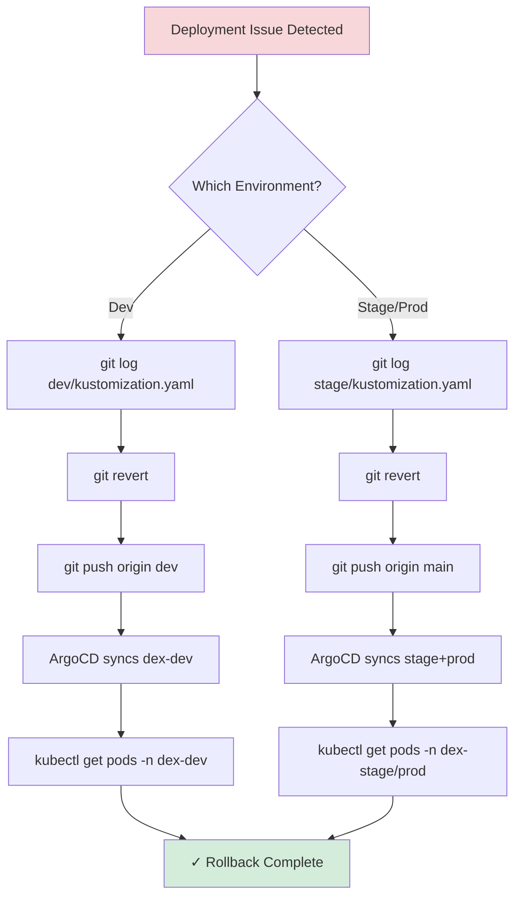

# Deployment Runbook

**Procedures for deploying and rolling back DEX across environments.**

> **Quick Links:** [Dev Deployment](#deploy-to-dev) · [Stage/Prod Deployment](#deploy-to-stageprod) · [Rollback](#rollback) · [Emergency Procedures](#emergency-rollback-kubernetes)

---

This runbook describes how to release and rollback DEX using the `dev` → `main` promotion flow.

## Environments

- **dev**: Deploys from `dev` branch via GitOps (auto-sync)
- **stage/prod**: Deploys from `main` branch via GitOps (auto-sync)



## Pre-Deploy Checklist

- CI is green on the target branch (`dev` or `main`).
- Image exists in registry: `ghcr.io/thedataenginex/dex:sha-XXXXXXXX`.
- No open critical alerts in monitoring.
- For production release, approval recorded in PR.

## Deploy to Dev

**Trigger**: Merge PR into `dev` branch.



**Expected Outcome**:
- CD updates `infra/argocd/overlays/dev/kustomization.yaml` in `dev`.
- ArgoCD syncs `dex-dev` to the new SHA.

**Verify**:
```bash
kubectl get pods -n dex-dev
argocd app get dex-dev
```

## Deploy to Stage/Prod

**Trigger**: Merge release PR from `dev` → `main`.



**Expected Outcome**:
- CD updates `infra/argocd/overlays/stage/kustomization.yaml` and `infra/argocd/overlays/prod/kustomization.yaml` in `main`.
- ArgoCD syncs `dex-stage` and `dex-prod` to the new SHA.

**Verify**:
```bash
kubectl get pods -n dex-stage
kubectl get pods -n dex-prod
argocd app get dex-stage
argocd app get dex-prod
```

## Rollback



### Rollback Dev

```bash
git log --oneline infra/argocd/overlays/dev/kustomization.yaml
git revert <commit-sha>
git push origin dev
```

ArgoCD will sync `dex-dev` back to the previous image.

### Rollback Stage/Prod

```bash
git log --oneline infra/argocd/overlays/stage/kustomization.yaml
git revert <commit-sha>
git push origin main
```

ArgoCD will sync `dex-stage` and `dex-prod` back to the previous image.

## Emergency Rollback (Kubernetes)

If ArgoCD is unavailable, roll back directly:

```bash
kubectl rollout undo deployment/dex -n dex-stage
kubectl rollout undo deployment/dex -n dex-prod
```

Record the rollback by reverting the manifest in git once ArgoCD is available.

## Org + Domain Rollout (GitHub + Cloudflare)

Use this section for organization-level setup and domain cutover to `thedataenginex.org`.

### GitHub Organization Setup

1. Create/verify teams referenced in `CODEOWNERS`:
    - `infra-team`
    - `backend-team`
    - `data-team`
2. Ensure each team has appropriate repo permissions.
3. Enable branch/ruleset protections for `main` and `dev`:
    - Require pull request reviews
    - Require status checks to pass before merge
    - Enforce CODEOWNERS review where needed
4. Enable Discussions for `TheDataEngineX/DEX`.
5. Create at least one organization Project and define fields (status, priority, milestone).
6. Configure project automation inputs:
    - Variable `ORG_PROJECT_URL` = full URL of the org project
    - Secret `ORG_PROJECT_TOKEN` = PAT with project write access

### GitHub Pages Setup (Docs)

Repository includes `.github/workflows/docs-pages.yml`.

1. In repo settings, enable **Pages** and select **GitHub Actions** as source.
2. Confirm `github-pages` environment is available.
3. Trigger workflow manually once (`Docs Pages Deploy`) to bootstrap deployment.
4. Verify `site/CNAME` in artifact contains `docs.thedataenginex.org`.

### Cloudflare DNS Setup

Configure DNS records for `thedataenginex.org`:

- `docs.thedataenginex.org` → CNAME to `<org-or-user>.github.io`
- `api.thedataenginex.org` → ingress/load balancer endpoint
- Apex `thedataenginex.org`:
  - CNAME flattening to chosen site host, or
  - A/AAAA to website host

### TLS / SSL

1. Set Cloudflare SSL mode compatible with origin (recommended: Full / Full strict).
2. Verify HTTPS for:
    - `https://docs.thedataenginex.org`
    - `https://api.thedataenginex.org`

### Fast 10–15 Minute Execution Checklist

1. Pages source = GitHub Actions.
2. Set `ORG_PROJECT_URL` + `ORG_PROJECT_TOKEN`.
3. Configure Cloudflare DNS (`docs`, `api`, apex).
4. Trigger workflows manually:
    - `Docs Pages Deploy`
    - `Label Sync`
    - `Project Automation`
5. Smoke checks:
    - Docs URL resolves with HTTPS
    - Test issue + PR auto-added to project
    - Labels from `.github/labels.yml` are present

### Exact Post-Merge Verification Order

1. Merge PR.
2. Wait for `Docs Pages Deploy` success.
3. Validate `https://docs.thedataenginex.org`.
4. Trigger `Label Sync` once and inspect labels.
5. Open temporary test issue/PR and confirm project automation.
6. Validate `https://api.thedataenginex.org` TLS/hostname routing.
7. Send controlled warning alert and verify `.org` sender/recipient behavior.

### Rollback for Domain Cutover

1. Revert Cloudflare DNS records to previous targets.
2. Set DNS-only mode temporarily for diagnostics if needed.
3. Re-run Pages deploy once DNS stabilizes.

---

## Related Documentation

**Deployment:**
- **[CI/CD Pipeline](CI_CD.md)** - Complete automation guide
- **[Local K8s Setup](LOCAL_K8S_SETUP.md)** - Kubernetes & ArgoCD setup

**Operations:**
- **[Observability](OBSERVABILITY.md)** - Monitor deployments
- **[SDLC](SDLC.md)** - Development lifecycle

---

**[← Back to Documentation Hub](docs-hub.md)**
