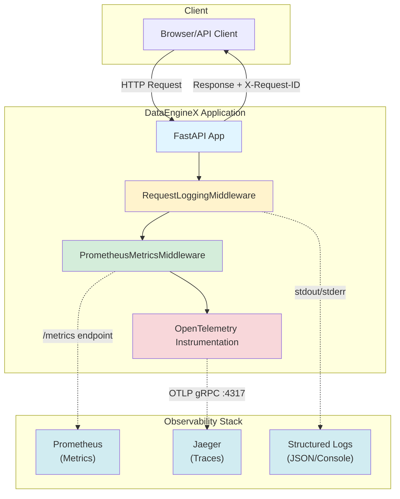
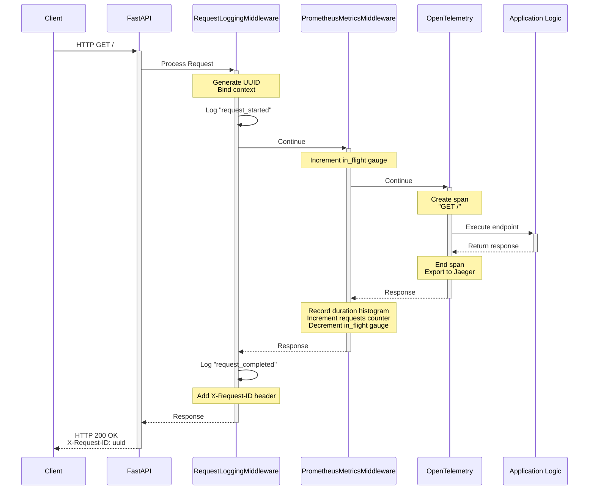
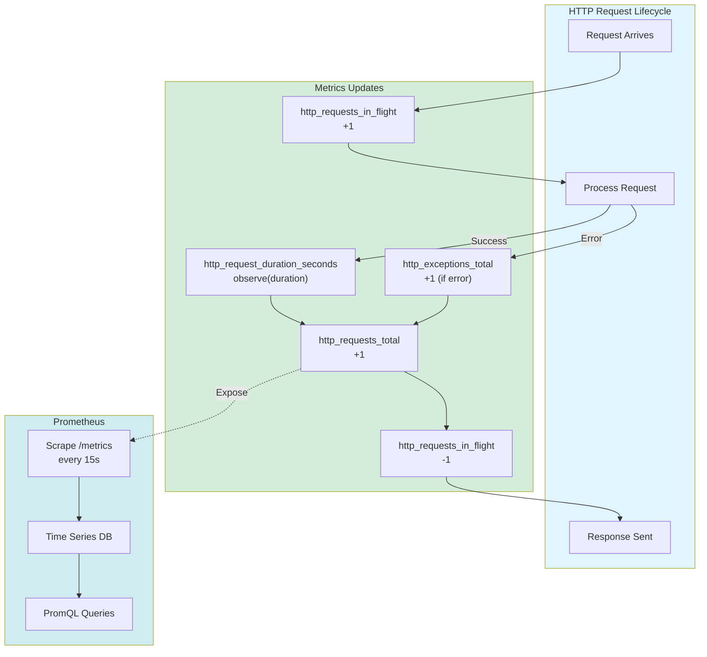
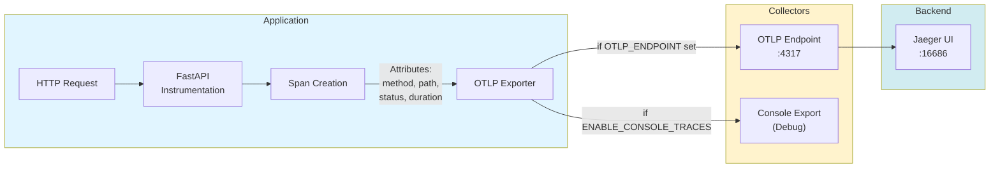

# Observability: Metrics, Logging & Tracing

**Complete guide to monitoring, debugging, and understanding DataEngineX in production.**

> **Quick Links:** [Metrics](#prometheus-metrics) · [Tracing](#opentelemetry-tracing) · [Logging](#structured-logging) · [Local Testing](#local-testing) · [Troubleshooting](#troubleshooting)

---

## 📋 Table of Contents

- [Overview](#overview)
- [Architecture](#architecture)
- [Prometheus Metrics](#prometheus-metrics)
- [OpenTelemetry Tracing](#opentelemetry-tracing)
- [Structured Logging](#structured-logging)
- [Local Testing](#local-testing)
- [Kubernetes Integration](#kubernetes-integration)
- [Troubleshooting](#troubleshooting)
- [Related Documentation](#related-documentation)

---

## Overview

DataEngineX implements comprehensive observability using **Prometheus** for metrics, **OpenTelemetry** for distributed tracing, and **Structlog** for structured logging.

## Architecture



### Request Flow



---

## Prometheus Metrics

### Available Metrics

| Metric | Type | Description | Labels |
|--------|------|-------------|--------|
| `http_requests_total` | Counter | Total HTTP requests | method, endpoint, status |
| `http_request_duration_seconds` | Histogram | Request duration | method, endpoint |
| `http_requests_in_flight` | Gauge | Requests currently processing | - |
| `http_exceptions_total` | Counter | Total exceptions | exception_type |

### Metrics Endpoint

Access Prometheus metrics at:
```
GET /metrics
```

**Example output:**
```
# HELP http_requests_total Total HTTP requests
# TYPE http_requests_total counter
http_requests_total{endpoint="/",method="GET",status="200"} 1543.0

# HELP http_request_duration_seconds HTTP request duration in seconds
# TYPE http_request_duration_seconds histogram
http_request_duration_seconds_bucket{endpoint="/",le="0.005",method="GET"} 1234.0
http_request_duration_seconds_bucket{endpoint="/",le="0.01",method="GET"} 1456.0
http_request_duration_seconds_sum{endpoint="/",method="GET"} 143.2
http_request_duration_seconds_count{endpoint="/",method="GET"} 1543.0
```

### Prometheus Configuration

Add this scrape config to `prometheus.yml`:

```yaml
scrape_configs:
  - job_name: 'dataenginex'
    scrape_interval: 15s
    static_configs:
      - targets: ['localhost:8000']
    metrics_path: '/metrics'
```

### Grafana Dashboard

**Key Queries:**

1. **Request Rate (RPS)**:
   ```promql
   rate(http_requests_total[5m])
   ```

2. **P95 Latency**:
   ```promql
   histogram_quantile(0.95, rate(http_request_duration_seconds_bucket[5m]))
   ```

3. **Error Rate**:
   ```promql
   rate(http_requests_total{status=~"5.."}[5m])
   ```

4. **In-Flight Requests**:
   ```promql
   http_requests_in_flight
   ```

### Metrics Collection Flow



---

## OpenTelemetry Tracing

### Configuration

#### Environment Variables

```bash
# OTLP Collector endpoint (Jaeger, Tempo, etc.)
# Accepts formats: "localhost:4317" or "http://localhost:4317"
export OTLP_ENDPOINT="http://localhost:4317"

# Enable console trace export for debugging (optional)
export ENABLE_CONSOLE_TRACES="true"
```

### Tracing Flow



### Automatic Instrumentation

FastAPI is automatically instrumented with OpenTelemetry. Every request creates:
- **Span** with request details (method, path, status)
- **Trace ID** for distributed tracing
- **Timing** information

### Manual Instrumentation

Add custom spans to your code:

```python
from dataenginex.tracing import get_tracer

tracer = get_tracer(__name__)

def my_function():
    with tracer.start_as_current_span("database_query") as span:
        span.set_attribute("query.table", "users")
        span.set_attribute("query.limit", 100)
        # ... do database work ...
        span.set_attribute("query.results", 42)
```

### Jaeger Setup

Run Jaeger with OTLP support:

```bash
docker run -d --name jaeger \
  -e COLLECTOR_OTLP_ENABLED=true \
  -e SPAN_STORAGE_TYPE=memory \
  -p 16686:16686 \
  -p 4317:4317 \
  -p 4318:4318 \
  -p 14250:14250 \
  jaegertracing/all-in-one:1.60
```

**PowerShell:**
```powershell
docker run -d --name jaeger `
  -e COLLECTOR_OTLP_ENABLED=true `
  -e SPAN_STORAGE_TYPE=memory `
  -p 16686:16686 `
  -p 4317:4317 `
  -p 4318:4318 `
  -p 14250:14250 `
  jaegertracing/all-in-one:1.60
```

Access Jaeger UI: http://localhost:16686

### Example Trace

```
Trace ID: 7f8a3b2c1d4e5f6a
│
├─ [150ms] GET /api/users
│  ├─ [80ms] database_query (users table)
│  ├─ [30ms] redis_cache_check
│  └─ [40ms] response_serialization
│
Total: 150ms
```

---

## Local Testing

### Quick Start

1. **Run the application**:
   ```bash
  uv lock
  uv sync
  uv run poe api
   ```

2. **Test metrics endpoint**:
   ```bash
   curl http://localhost:8000/metrics
   ```
   
   **Expected output:**
   ```
   # HELP http_requests_total Total HTTP requests
   # TYPE http_requests_total counter
   http_requests_total{endpoint="/",method="GET",status="200"} 1.0
   ...
   ```

3. **Generate traffic to see metrics**:
   ```bash
   # Make some requests
   curl http://localhost:8000/
   curl http://localhost:8000/health
   curl http://localhost:8000/readiness
   
   # Check updated metrics
   curl http://localhost:8000/metrics
   ```

### Test with Jaeger (Optional)

1. **Start Jaeger locally**:
   ```bash
   docker run -d --name jaeger \
     -e COLLECTOR_OTLP_ENABLED=true \
     -e SPAN_STORAGE_TYPE=memory \
     -p 16686:16686 \
     -p 4317:4317 \
     -p 4318:4318 \
     -p 14250:14250 \
     jaegertracing/all-in-one:1.60
   ```
   
   **PowerShell:**
   ```powershell
   docker run -d --name jaeger `
     -e COLLECTOR_OTLP_ENABLED=true `
     -e SPAN_STORAGE_TYPE=memory `
     -p 16686:16686 `
     -p 4317:4317 `
     -p 4318:4318 `
     -p 14250:14250 `
     jaegertracing/all-in-one:1.60
   ```

2. **Run application with tracing**:
   ```bash
   export OTLP_ENDPOINT="http://localhost:4317"
  uv run poe api
   ```

3. **Generate traces**:
   ```bash
   # Make several requests
   for i in {1..10}; do curl http://localhost:8000/; done
   ```

4. **View traces in Jaeger UI**:
   - Open: http://localhost:16686
   - Select service: "dataenginex"
   - Click "Find Traces"

### Test Console Traces (No Jaeger Required)

Enable console trace export to see traces in logs:

```bash
export ENABLE_CONSOLE_TRACES="true"
uv run poe api
```

Make a request and check console output:
```bash
curl http://localhost:8000/
```

**Console output:**
```json
{
  "name": "GET /",
  "context": {
    "trace_id": "0x7f8a3b2c1d4e5f6a...",
    "span_id": "0x1234567890abcdef"
  },
  "kind": "SpanKind.SERVER",
  "parent_id": null,
  "start_time": "2026-02-05T10:30:00.000000Z",
  "end_time": "2026-02-05T10:30:00.150000Z",
  "status": {
    "status_code": "UNSET"
  },
  "attributes": {
    "http.method": "GET",
    "http.route": "/",
    "http.status_code": 200
  }
}
```

### Run Tests

Verify metrics and tracing implementation:

```bash
# Run observability tests
uv run poe test

# Run all tests with coverage
uv run poe test-cov
```

**Expected:**
- 23 tests passing
- Coverage >90%

### PowerShell (Windows)

```powershell
# Set environment variables
$env:OTLP_ENDPOINT = "http://localhost:4317"
$env:ENABLE_CONSOLE_TRACES = "true"

# Run application
uv run poe api

# Test metrics
Invoke-WebRequest -Uri http://localhost:8000/metrics

# Generate traffic
1..10 | ForEach-Object { Invoke-WebRequest -Uri http://localhost:8000/ }
```

---

## Integration Examples

### Docker Compose

```yaml
version: '3.8'

services:
  dataenginex:
    build: .
    ports:
      - "8000:8000"
    environment:
      - LOG_LEVEL=INFO
      - OTLP_ENDPOINT=http://jaeger:4317
  
  prometheus:
    image: prom/prometheus
    ports:
      - "9090:9090"
    volumes:
      - ./prometheus.yml:/etc/prometheus/prometheus.yml
  
  jaeger:
    image: jaegertracing/all-in-one:1.60
    environment:
      - COLLECTOR_OTLP_ENABLED=true
      - SPAN_STORAGE_TYPE=memory
    ports:
      - "16686:16686"  # UI
      - "4317:4317"    # OTLP gRPC
      - "4318:4318"    # OTLP HTTP
      - "14250:14250"  # gRPC
  
  grafana:
    image: grafana/grafana
    ports:
      - "3000:3000"
    environment:
      - GF_SECURITY_ADMIN_PASSWORD=admin
```

### Kubernetes

```yaml
apiVersion: v1
kind: Service
metadata:
  name: dataenginex
  labels:
    app: dataenginex
spec:
  ports:
    - port: 8000
      name: http
  selector:
    app: dataenginex

---
apiVersion: monitoring.coreos.com/v1
kind: ServiceMonitor
metadata:
  name: dataenginex
spec:
  selector:
    matchLabels:
      app: dataenginex
  endpoints:
    - port: http
      path: /metrics
      interval: 15s
```

---

## Alerts

### Example Prometheus Alerts

```yaml
groups:
  - name: dataenginex
    rules:
      - alert: HighErrorRate
        expr: |
          rate(http_requests_total{status=~"5.."}[5m]) > 0.05
        for: 5m
        labels:
          severity: critical
        annotations:
          summary: "High error rate detected"
          description: "Error rate is {{ $value }} errors/sec"

      - alert: HighLatency
        expr: |
          histogram_quantile(0.95, rate(http_request_duration_seconds_bucket[5m])) > 1
        for: 5m
        labels:
          severity: warning
        annotations:
          summary: "High latency detected"
          description: "P95 latency is {{ $value }}s"
```

---

## Best Practices

### Metrics

1. **Use labels wisely**: Keep cardinality low (< 1000 unique label combinations)
2. **Histogram buckets**: Adjust buckets based on your latency distribution
3. **Counter vs Gauge**: Use counters for totals, gauges for current values
4. **Naming**: Follow Prometheus naming conventions (`_total`, `_seconds`)

### Tracing

1. **Sampling**: In high-traffic scenarios, sample traces (e.g., 1% of requests)
2. **Span attributes**: Add relevant context but avoid PII
3. **Error tracking**: Mark spans with errors using `span.set_status()`
4. **Span naming**: Use consistent, hierarchical names

### Performance

- Metrics collection: ~0.1ms overhead per request
- Tracing overhead: ~1-2ms per request (depends on sampling)
- `/metrics` endpoint: Excluded from metrics to avoid recursion

---

## Health Checks

DEX provides three health endpoints for Kubernetes probes:

- **/health** (liveness) — returns component status and overall health
- **/ready** (readiness) — returns readiness based on dependency checks
- **/startup** (startup) — indicates app initialization completion

### Configure Dependency Checks

Set these environment variables to enable component checks:

```bash
export DEX_DB_HOST="db"
export DEX_DB_PORT="5432"

export DEX_CACHE_HOST="redis"
export DEX_CACHE_PORT="6379"

export DEX_EXTERNAL_API_URL="https://api.example.com/health"
```

If a component is not configured, it will show **skipped** in the response.

---

## Troubleshooting

### Metrics not appearing

1. Check `/metrics` endpoint is accessible
2. Verify Prometheus can scrape the endpoint
3. Check Prometheus targets: http://localhost:9090/targets

### Service not appearing in Jaeger UI

**Troubleshooting steps:**

1. **Verify Jaeger is running**:
   ```bash
   docker ps | grep jaeger
   ```

2. **Check OTLP_ENDPOINT is set**:
   ```bash
   # Bash/Linux
   echo $OTLP_ENDPOINT
   
   # PowerShell
   $env:OTLP_ENDPOINT
   ```
   Should output: `http://localhost:4317`

3. **Generate traffic** - Jaeger only shows services that have sent traces:
   ```bash
   # Make several requests
   curl http://localhost:8000/
   curl http://localhost:8000/health
  curl http://localhost:8000/ready
   ```

4. **Verify service name** - Check application logs on startup:
   ```json
   {
     "event": "application_started",
     "service.name": "dataenginex"
   }
   ```

5. **Check Jaeger received traces**:
   - Open Jaeger UI: http://localhost:16686
   - Click the "Service" dropdown
   - Look for "dataenginex" (matches APP_NAME env var)
   - If not visible, select time range "Last Hour" and click "Find Traces"

6. **Check for export errors** in application output:
   ```
   StatusCode.UNAVAILABLE - Jaeger not reachable
   StatusCode.INVALID_ARGUMENT - Configuration error
   ```

7. **Enable console traces for debugging**:
   ```bash
   export ENABLE_CONSOLE_TRACES="true"
   # Restart app - you'll see spans printed to console
   ```

8. **Verify port 4317 is accessible**:
   ```bash
   # Check if Jaeger is listening on OTLP port
   netstat -an | grep 4317
   # or
   curl -v telnet://localhost:4317
   ```

### High memory usage

1. Reduce trace sampling rate
2. Check for metric label cardinality explosion
3. Monitor `/metrics` response size

---

## Testing

Run observability tests:

```bash
uv run poe test
```

---

## Related Documentation

**Deployment & Operations:**
- **[CI/CD Pipeline](CI_CD.md)** - Automated deployments
- **[Deployment Runbook](DEPLOY_RUNBOOK.md)** - Deploy procedures
- **[Infrastructure](../infra/README.md)** - Kubernetes setup

**Development:**
- **[SDLC](SDLC.md)** - Development workflow
- **[Contributing](../CONTRIBUTING.md)** - Contribution guide

---

**[← Back to Documentation Hub](README.md)**
