# DEX Documentation Guide (Start Here)

This page is the entry point for developers. It explains how the repo is organized, how work flows from code to deployment, and where to find deeper documentation.

## What This Repo Does

DEX (DataEngineX) is a Python platform that ships a FastAPI service and supports ML/data pipelines with a production-grade CI/CD + GitOps deployment flow.

## How Changes Flow (High Level)

```mermaid
graph LR
    Feature["feature/* branch"] --> DevPR["PR → dev"]
    DevPR --> DevCI["CI: lint/test/build"]
    DevCI --> DevCD["CD: update dev overlay (dev branch)"]
    DevCD --> DevApp["ArgoCD syncs dex-dev"]
    DevApp --> ReleasePR["Release PR: dev → main"]
    ReleasePR --> MainCI["CI: lint/test/build"]
    MainCI --> MainCD["CD: update stage/prod overlays (main)"]
    MainCD --> StageProd["ArgoCD syncs dex-stage + dex-prod"]
```



## Repository Tour

```
root/
├── src/dataenginex/          # FastAPI app and core code
├── pipelines/                # Example data/ML pipelines
├── workflows/                # Workflow definitions
├── infra/                    # Kubernetes + ArgoCD GitOps manifests
├── .github/workflows/        # CI/CD workflows
├── docs/                     # Documentation (this folder)
└── tests/                    # Unit/integration tests
```

## Common Tasks

### Run Locally

```bash
poetry install
poetry run uvicorn dataenginex.main:app --reload
```

### Run Quality Checks

```bash
poetry run pytest -v
poetry run ruff check src/ tests/ && poetry run black --check . && poetry run mypy src/ --ignore-missing-imports
# Or use the poe lint shortcut:
poe lint
```

## Where To Go Next

- [README](../Readme.md) — quick start and developer workflow
- [SDLC](SDLC.md) — lifecycle stages, gates, and artifacts
- [Infrastructure Guide](../infra/README.md) — GitOps, ArgoCD, Kustomize
- [Local K8s Setup](LOCAL_K8S_SETUP.md) — run ArgoCD locally
- [Deploy Runbook](DEPLOY_RUNBOOK.md) — release + rollback
- [Monitoring](monitoring.md) — metrics, logs, traces
