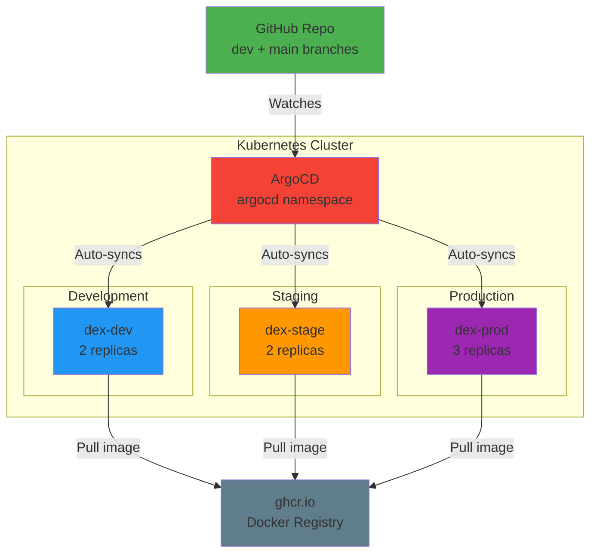

# Infrastructure-as-Code (IaC) Guide

This folder contains all Kubernetes manifests for DEX using **Kustomize** for environment configuration and **ArgoCD** for GitOps deployment automation.

**Key Principle**: Infrastructure state is version-controlled in git. ArgoCD continuously syncs the cluster to match the git source of truth.

## Architecture Overview



## Folder Structure

```
infra/
├── README.md                 # This documentation
├── application.yaml          # ArgoCD Application, ApplicationSet, and AppProject manifests
└── argocd/
    ├── base/                 # Shared base manifests (all environments)
    │   ├── deployment.yaml   # Deployment with probes and resource limits
    │   ├── service.yaml      # ClusterIP service exposing port 8000
    │   └── kustomization.yaml # Base image reference (ghcr.io/data-literate/dex)
    └── overlays/             # Environment-specific Kustomize patches
        ├── dev/              # Development environment (2 replicas, DEBUG logs)
        ├── stage/            # Staging environment (2 replicas, INFO logs)
        ├── prod/             # Production environment (3 replicas, WARN logs)
        └── preview/          # PR Preview (ephemeral, dex-pr-{{pr_number}} namespace)
```

**Files Generated by CI/CD:**
- `overlays/dev/kustomization.yaml` — Updated by CD workflow on the `dev` branch after each successful CI run on `dev`
- `overlays/stage/kustomization.yaml` and `overlays/prod/kustomization.yaml` — Updated by CD workflow on the `main` branch after each successful CI run on `main`

## Kustomize Overlays

### Base Configuration (`argocd/base/`)

**deployment.yaml**
- Replicas: `2` (template default, overridden by overlays)
- Image: `ghcr.io/data-literate/dex` (tag set by overlays)
- Port: `8000` (HTTP)
- Probes: Liveness and Readiness (checks `/health` endpoint)
- Resources: `100m` CPU / `128Mi` memory (requests and limits)

**service.yaml**
- Type: `ClusterIP`
- Port: `8000`
- Target: Deployment pods on port `8000`

**kustomization.yaml**
- Image reference: `ghcr.io/data-literate/dex`
- Overlays patch this reference with environment-specific tags

---

### Environment-Specific Configuration

| Property | Dev | Stage | Prod | Preview |
|----------|-----|-------|------|---------|
| **Replicas** | 2 | 2 | 3 | 2 |
| **Namespace** | `dex-dev` | `dex-stage` | `dex-prod` | `dex-pr-{{pr_number}}` |
| **Log Level** | DEBUG | INFO | WARN | DEBUG |
| **Image Tag** | `sha-{commit}` | `sha-{commit}` | `sha-{commit}` | `sha-{pr_commit}` |
| **CPU** | 100m | 100m | 200m | 100m |
| **Memory** | 128Mi | 128Mi | 256Mi | 128Mi |
| **Sync Policy** | Auto | Auto | Auto | Auto |
| **Lifetime** | Permanent | Permanent | Permanent | Until PR closes |

---

### Kustomization Patches

Each overlay applies strategic merge patches to the base:

**overlays/dev/kustomization.yaml**
```yaml
apiVersion: kustomize.config.k8s.io/v1beta1
kind: Kustomization

resources:
  - ../../base

replicas:
  - name: dex
    count: 2

images:
  - name: ghcr.io/data-literate/dex
    newTag: sha-COMMIT_SHA

namespace: dex-dev

patches:
  - target:
      kind: Deployment
    patch: |-
      - op: add
        path: /spec/template/spec/containers/0/env
        value:
          - name: LOG_LEVEL
            value: DEBUG
```

**overlays/stage/ and overlays/prod/** follow the same pattern with different replicas, namespaces, and LOG_LEVEL.

## ArgoCD Resources

### Application (application.yaml)

**Purpose**: Basic Application resource pointing to base kustomization. Used as fallback/example for single-environment deployments.

**Specification**:
```yaml
apiVersion: argoproj.io/v1alpha1
kind: Application
metadata:
  name: dex
  namespace: argocd
spec:
  project: default
  source:
    repoURL: https://github.com/data-literate/DEX
    targetRevision: main
    path: infra/argocd/base
  destination:
    server: https://kubernetes.default.svc
    namespace: default
  syncPolicy:
    automated:
      prune: true
      selfHeal: true
```

---

### ApplicationSet - Multi-Environment

**Purpose**: Generates 3 Applications (dev, stage, prod) from a single parameterized template.

**Template Parameters**:
- `environment`: dev, stage, prod
- `namespace`: dex-dev, dex-stage, dex-prod
- `replicas`: 2, 2, 3 (respectively)

**Generated Applications**:
1. `dex-dev` → syncs `infra/argocd/overlays/dev` from branch `dev` to namespace `dex-dev`
2. `dex-stage` → syncs `infra/argocd/overlays/stage` from branch `main` to namespace `dex-stage`
3. `dex-prod` → syncs `infra/argocd/overlays/prod` from branch `main` to namespace `dex-prod`

**Sync Policy**: `syncPolicy.automated.selfHeal: true` (ArgoCD corrects drift every 3 minutes)

---

### ApplicationSet - PR Preview (Future)

**Purpose**: Auto-creates ephemeral Applications for pull requests to enable preview deployments.

**Spec**:
- Trigger: Pull request with `preview: enabled` label
- Namespace: `dex-pr-{{pull_request.number}}`
- Image Tag: `sha-{{head_commit.short_sha}}`
- TTL: Deleted when PR closes

---

### AppProject

**Purpose**: RBAC and policy enforcement for Applications.

**Restrictions**:
- **Allowed Source Repositories**: `https://github.com/data-literate/DEX` (co-located config + code)
- **Allowed Destination**: Namespaces matching `dex-*`, `dex-pr-*`, `default`; Server: `https://kubernetes.default.svc` (local cluster)
- **Policy**: `signatureKeys` not enforced (non-production setup)

## Promotion Workflow

### Step 1: Code Commit → CI Workflow

**Trigger**:
- Push to `dev` branch (integration)
- Push to `main` branch (release)

**CI Workflow Actions** (`.github/workflows/ci.yml`):
1. **Lint & Test**: `ruff check`, `black --check`, `mypy src/`, `pytest -v`
2. **Build Image**: `docker build -t dex:sha-XXXXXXXX .` (8-char commit SHA)
3. **Push to Registry**: `docker push ghcr.io/data-literate/dex:sha-XXXXXXXX`
4. **Trigger CD Workflow**: Via `workflow_run` event

---

### Step 2: CD Workflow Updates Manifests

**Trigger**: CI workflow completion

**CD Workflow Actions** (`.github/workflows/cd.yml`):

**Dev Branch (integration)**
1. **Update Manifest**: Modify `infra/argocd/overlays/dev/kustomization.yaml`
  ```yaml
  images:
    - name: ghcr.io/data-literate/dex
     newTag: sha-XXXXXXXX
  ```
2. **Commit & Push**:
  ```
  git commit -m "chore: update dev image to sha-XXXXXXXX [skip ci]"
  git push origin dev
  ```

**Main Branch (release)**
1. **Update Manifests**: Modify `infra/argocd/overlays/stage/kustomization.yaml` and `infra/argocd/overlays/prod/kustomization.yaml`
2. **Commit & Push**:
  ```
  git commit -m "chore: update stage/prod image to sha-XXXXXXXX [skip ci]"
  git push origin main
  ```

---

### Step 3: ArgoCD Syncs Environments

**Trigger**: Git webhook notification (manifest change detected)

**ArgoCD Auto-Sync** (`syncPolicy.automated`):
1. **Dev App** tracks branch `dev` and syncs `infra/argocd/overlays/dev` → namespace `dex-dev`
2. **Stage App** tracks branch `main` and syncs `infra/argocd/overlays/stage` → namespace `dex-stage`
3. **Prod App** tracks branch `main` and syncs `infra/argocd/overlays/prod` → namespace `dex-prod`

---

### Summary: Single SHA Per Branch

| Branch | Dev | Stage | Prod |
|--------|-----|-------|------|
| `dev` | `sha-ABC123` | — | — |
| `main` | — | `sha-DEF456` | `sha-DEF456` |

**Immutability**: Each branch deploys a single immutable SHA across its target environments.

---

### Rollback Procedure

**Rollback dev**:
1. `git log --oneline infra/argocd/overlays/dev/kustomization.yaml`
2. `git revert COMMIT_HASH`
3. `git push origin dev`
4. ArgoCD syncs dev to previous SHA

**Rollback stage/prod**:
1. `git log --oneline infra/argocd/overlays/stage/kustomization.yaml`
2. `git revert COMMIT_HASH`
3. `git push origin main`
4. ArgoCD syncs stage/prod to previous SHA

---

## Image Registry Configuration

**Current Registry**: `ghcr.io/data-literate/dex`

**To change registry**, update `infra/argocd/base/kustomization.yaml`:
```yaml
images:
  - name: ghcr.io/data-literate/dex
    newName: docker.io/myorg/dex  # Change this
    newTag: v1.0.0
```

All overlays will inherit the new registry.

## Kustomize Commands

### Preview Generated Manifests

**Dev Environment**:
```bash
cd infra/argocd
kustomize build overlays/dev
```

**Stage Environment**:
```bash
kustomize build overlays/stage
```

**Production Environment**:
```bash
kustomize build overlays/prod
```

**PR Preview Environment**:
```bash
kustomize build overlays/preview
```

### Apply via kubectl (ArgoCD does this automatically)

```bash
kubectl apply -k infra/argocd/overlays/dev
kubectl apply -k infra/argocd/overlays/stage
kubectl apply -k infra/argocd/overlays/prod
```

### Validate Kustomization

```bash
cd infra/argocd
kustomize build overlays/dev > /tmp/dev-manifest.yaml
# Review /tmp/dev-manifest.yaml for correctness
```

## Local Development & Testing

### Prerequisites
- Kubernetes cluster (Docker Desktop, minikube, or local k8s)
- `kubectl` configured with cluster access
- `kustomize` installed (`v4.0+`)
- `argocd` CLI installed (optional, for manual sync)

### 1. Install ArgoCD

```bash
# Create ArgoCD namespace
kubectl create namespace argocd

# Install ArgoCD (stable version)
kubectl apply -n argocd -f https://raw.githubusercontent.com/argoproj/argo-cd/stable/manifests/install.yaml

# Wait for pods to be ready
kubectl wait --for=condition=ready pod -l app.kubernetes.io/name=argocd-server -n argocd --timeout=300s
```

### 2. Access ArgoCD UI

```bash
# Port-forward ArgoCD server
kubectl port-forward -n argocd svc/argocd-server 8080:443 &

# Retrieve admin password
ADMIN_PASSWORD=$(kubectl -n argocd get secret argocd-initial-admin-secret -o jsonpath="{.data.password}" | base64 -d)
echo "Admin password: $ADMIN_PASSWORD"

# Login at: https://localhost:8080
```

### 3. Deploy Applications

```bash
# Apply ArgoCD resources (Application, ApplicationSet, AppProject)
kubectl apply -f infra/application.yaml

# Verify Applications created
kubectl get applications -n argocd

# Expected output:
# NAME           SYNC STATUS   HEALTH STATUS
# dex-dev        Synced        Healthy
# dex-stage      Synced        Healthy
# dex-prod       Synced        Healthy
```

### 4. Manual Sync (Optional)

```bash
# List all applications
argocd app list

# Get detailed status of dev app
argocd app get dex-dev

# Manually trigger sync (normally automatic)
argocd app sync dex-dev

# Wait for sync to complete
argocd app wait dex-dev
```

### 5. Test Application Deployment

```bash
# Check pod status in dev namespace
kubectl get pods -n dex-dev
kubectl logs -n dex-dev -l app=dex --tail=20

# Port-forward to test app endpoint
kubectl port-forward -n dex-dev svc/dex 8000:8000 &

# Test health endpoint
curl http://localhost:8000/health
```

---

## Troubleshooting

### Application Status is "Unknown" or "Unhealthy"

```bash
# Inspect application details
argocd app get dex-dev

# Check application logs
argocd app logs dex-dev

# Describe Kubernetes resource
kubectl describe application dex-dev -n argocd

# Common issues:
# - Invalid image tag (check overlays/dev/kustomization.yaml)
# - Namespace doesn't exist (ArgoCD creates it automatically)
# - Base path incorrect in application.yaml
```

### Kustomize Build Fails

```bash
cd infra/argocd

# Try building manually
kustomize build overlays/dev

# Check for errors:
# - Invalid YAML syntax
# - Missing base/ directory
# - Image name mismatch in overlays
```

### Pods Stay in "Pending" or "ImagePullBackOff"

```bash
# Check pod events
kubectl describe pod -n dex-dev POD_NAME

# Verify image exists in registry
docker pull ghcr.io/data-literate/dex:sha-XXXXXXXX

# Check image pull secrets (if using private registry)
kubectl get secrets -n dex-dev

# View pod logs
kubectl logs -n dex-dev POD_NAME --tail=50
```

### Git Change Not Triggering Sync

```bash
# Force ArgoCD to refresh from git
argocd app refresh dex-dev --hard

# Check git credentials in ArgoCD
kubectl get secret -n argocd github-creds -o yaml

# View sync policy
argocd app get dex-dev | grep -A 5 "syncPolicy"
```

---

## Future: Secrets Management

### Current State
Secrets are stored in `.env` files (local development only). **Do not commit `.env` to git.**

### Recommended for Production
**Option 1: Sealed Secrets** (recommended for GitOps)
- Install: `https://github.com/bitnami-labs/sealed-secrets`
- Encrypt secrets at rest in git
- ArgoCD auto-unseals on deploy

**Option 2: External Secrets Operator**
- Sync secrets from AWS Secrets Manager, HashiCorp Vault, etc.
- Keeps git as source of truth for config only

**Option 3: Cloud Provider Secret Management**
- AWS Secrets Manager, GCP Secret Manager, Azure Key Vault
- Pod ServiceAccount references secret URN

---

## References

- [Kustomize Documentation](https://kustomize.io/)
- [ArgoCD Documentation](https://argo-cd.readthedocs.io/)
- [Kubernetes Deployments](https://kubernetes.io/docs/concepts/workloads/controllers/deployment/)
- [12-Factor App - Config Best Practices](https://12factor.net/config)
